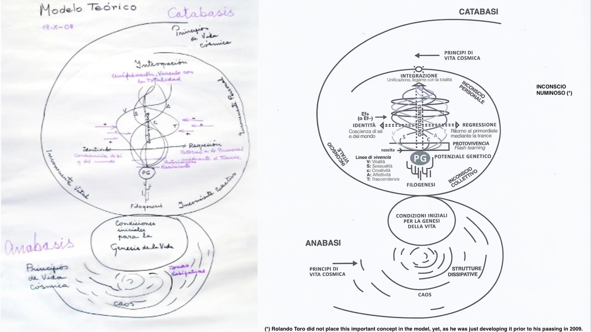

# Introductie {#intro}

Mijn Biodanza-reis begon in 2018. Mijn vrouw Fien startte de opleiding tot Biodanza docent  en samen sloten we ons aan bij een wekelijkse Biodanza-groep van Ann Vanhooreweder in Brugge. We voelden al snel de positieve impact van  Biodanza op ons leven.

Twee jaar later vond er echte Biodanza-magie plaats. In januari 2019 kreeg onze oudste zoon een zwaar fietsongeluk, waarvan hij goed herstelde. Het transformeerde onze relatie als koppel echter tijdelijk tot een relatie "van zorgen voor elkaar". Begin 2020 realiseerden we ons dat de gebeurtenissen onze band enorm hadden verdiept, maar dat ten koste van passie en aantrekkingskracht. Het "zorgen voor elkaar" betekende dat we afwisselend in onze kracht gingen staan om de ander te "containen" waardoor onze emoties niet langer samenvielen. Ondanks onze inspanningen en dat we met ons hoofd ergens wisten wat er moest gebeuren, was het moeilijk om onze gevoelens weer op elkaar af te stemmen.

De Biodanza-magie overkwam ons op Annette's Biodanza vijfdaagse in de zomer van 2020. Die begon met een integrerende vivencia (Biodanza-sessie). De sleuteloefening van de vivencia was de ontmoeting. Zodra onze blikken kruisten, sloeg de emotie bij me binnen en zag ik dat Fien hetzelfde voelde. Het gebeurde in een oogwenk, hier en nu, en sindsdien hebben we onze emotionele resonatie hervonden...

Hoe kan Biodanza zo transformerend zijn? Biodanza maakt gebruik van de kracht van muziek en beweging in een affectieve groep om vivencia op te roepen, een diepe ervaring met een sterke lichamelijke component. Vivencia gebeurt hier en nu en gaat ons mentale bewustzijn vooraf. Het kan positieve veranderingsprocessen op gang brengen die diep door kunnen werken in ons dagelijkse leven.

```{r rolandoToro, fig.cap='Rolando Toro, de ontwikkelaar van Biodanza', echo=FALSE,out.width="45%",fig.align='center'}
#,out.extra='style="float:left; padding:10px"'}
knitr::include_graphics("./figs/rolando.jpeg")
```

Voor Rolando Toro, die Biodanza ontwikkelde, was het meest belangrijke “Vivencia, Vivencia, Vivencia”. Intens het leven ervaren door middel van dans, muziek en beweging waardoor we ons diep kunnen verbinden met onszelf, de ander en het groter geheel. Biodanza laat ons voelen dat het leven één is en dat door een diepe, intense lichamelijke beleving (vivencia). 

Rolando Toro heeft het systeem van Biodanza ontwikkeld als antwoord op de degeneratie van de mens en de maatschappij die WOII voor hem blootlegde. Voor Rolando was het duidelijk dat de moderne mens lijdt aan de "ziekte van de beschaving". Die brengt ons zo ver van ons natuurlijke staat van zijn, van het voelen, affectie en inleven in de ander; waardoor ieder van ons tot extreme wreedheden kan worden bewogen.  

Hij wilde daar een systeem van liefde en hoop tegenoverzetten.  Een systeem waardoor er een affectieve heropvoeding mogelijk wordt en die de mens uitnodigt zich opnieuw te ontwikkelen in al zijn/haar schoonheid. Biodanza dus als systeem dat de mens wakker maakt om deel te nemen aan een nieuwe manier van leven en dat gevoed vanuit intense belevingen.  

Rolando was een gepassioneerde wetenschapper en een professor in de psychologie. Hij ontwikkelde Biodanza vanuit zijn eigen ervaringen en dat diep ingebed in de levenswetenschappen. Hij werd ook enorm geïnspireerd door de grondleggers van de moderne dans en door oervolkeren die een diepe betekenis leggen in elke beweging. Als we als mens leren om weer betekenis toe te voegen aan onze bewegingen, gaan we weer doorleefd in het leven staan, verbonden met al wat is.  

```{r rolandoModel, fig.cap='Rolando Toro legt zijn Biodanza-Model uit', echo=FALSE,out.width="45%",fig.align='center'}
#,out.extra='style="float:left; padding:10px"'}
knitr::include_graphics("./figs/rolandoAndModel.jpeg")
```


Rolando heeft de basis van zijn systeem gelegd tijdens zijn loopbaan als psycholoog/onderzoeker waar hij de grote impact ontdekte van oefeningen die identiteit en biologische regressie stimuleren, de eerste as van zijn systeem. In tegenstelling tot de klassieke visie van de psychiatrie die symptomatisch werkt en medicijnen toedient, ontwikkelde Rolando de visie om het lichaam door middel van externe stimuli (ecofactoren), zoals muziek, beweging, aanraking en dans, te stimuleren om deze stoffen eenvoudigweg zelf intern aan te maken. Op die manier worden we gestimuleerd om onszelf te herbalanceren, om te groeien en om de informatie in ons genetisch potentieel opnieuw aan te boren. 

Groei en leren gebeurt in Biodanza zoals bij kinderen: door te zien, te imiteren, te beleven en door herhaling, en dat diep ingebed in een verrijkte omgeving met positieve bekrachtiging.

In het vervolg van dit hoofdstuk zullen we de basis leggen die nodig is om ons te kunnen verdiepen in de biologische aspecten van Biodanza. We beginnen met de definitie van Biodanza. We gaan verder met Rolando's Biocentrische Principe. Vervolgens introduceren we het Biodanza-Model en sluiten we af met de doelstellingen van deze monografie.

## Definitie van Biodanza

Rolando bedacht de term "Biodanza", wat een samentrekking is van "bios", het Griekse woord voor "leven", en "danza", het Spaanse woord voor dans. Hierbij wordt het woord "danza" gebruikt in zijn oorspronkelijke betekenis van "natuurlijke beweging" die vol is van betekenis en dat sterk verbonden  met onze emoties.

<!-- Marcelo Mur defines Biodanza in its most simple form as a system of moderate movement and stimulation of sociability. -->
Rolando Toro definieerde Biodanza als de poëzie van de ontmoeting. Alle oefeningen kunnen inderdaad worden gezien als een voorbereiding op de ontmoeting met jezelf, de ander en het groter geheel. 

In Rolando's meer academische definitie is Biodanza een systeem van menselijke integratie, van organische vernieuwing, van affectieve heropvoeding en van het opnieuw leren van de oorspronkelijke functies van het leven.

De methodologie van Biodanza bestaat uit het induceren van integrerende vivencia door middel van muziek, beweging en ontmoetingen in een affectieve groep.

In 2009 werkte hij zijn definitie als volgt bij:  "Biodanza is een systeem dat integratieve processen versnelt op cellulair, immunologisch, metabolisch, neuro-endocrino en existentieel niveau door een verrijkte omgeving te bieden met geselecteerde muziek, integratieve beweging, strelingen en groepsinteracties."

In de onderstaande secties leggen we de verschillende delen van de definitie uit. 

### Vivencia 

Het concept vivencia is essentieel om de methode van Biodanza te begrijpen. 

Vivencia is een intense sensatie van leven, hier en nu, met een sterke lichamelijke component. Het is een manifestatie van het zijn die aan ons mentale bewustzijn voorafgaat. Vivencia zijn voorbijgaande ervaringen, bijvoorbeeld de vivencia van volheid, van veiligheid, van vreugde. Het besef van het ervaren van vivencia kan onmiddellijk plaatsvinden of op een later moment en kan aanleiding geven tot diepe emoties.

We hoeven onze vivencia niet te rationaliseren. Ze kunnen worden gezien als manifestaties van onze lichamelijke wijsheid en brengen spontaan integratie en leren door ervaring op gang. Het zijn transformerende ervaringen, die de essentie vormen van de methode van Biodanza. Onze vivencia zijn inderdaad van cruciaal belang voor groei en integratie. Het beoefenen van Biodanza kan ook een gevoel van ontwaken teweegbrengen als we merken dat er groei heeft plaatsgevonden na de integratie van onze vivencia.


### Menselijke Integratie

Door vivencia wordt een sterke verbinding met het leven tot stand gebracht, die de integratie met jezelf, de menselijke soort en het universum versterkt.

De integratie met onszelf herstelt onze psycho-fysieke eenheid, d.w.z. de eenheid van de interne/psychische en externe/fysieke wereld.

Integratie met de anderen herstelt de verbinding met onze menselijke soort, onze biologische eenheid.

Integratie met het universum herenigt ons met de natuur en herstelt onze intieme relatie met de hele biosfeer. Het laat ons opnieuw de diepe verbondenheid van onszelf als onderdeel van de kosmos ervaren.

Door deze verbinding met het leven te herstellen, kunnen we de kern van het leven opnieuw ervaren, hier en nu, wat groei en vernieuwing op biologisch, fysiologisch en psycho-emotioneel vlak bevordert en ook gepaard kan gaan met een gevoel van een diepe bewustwording. 

###  Organische Vernieuwing

Biologische systemen bezitten het unieke vermogen tot zelfreplicatie en zelforganisatie. Stress kan een diepgaande invloed hebben op het onderhoud en de regeneratie van onze cellen en weefsels.

Met transcendente Biodanza-oefeningen vertragen we onze bewegingen, verlagen we onze staat van controle en roepen we een diepe staat van rust op. Deze toestand is essentieel om herstel en regeneratieprocessen op gang te brengen. Het versterkt de homeostase, het mechanisme van ons lichaam om zijn evenwicht te behouden ondanks de veranderingen in onze omgeving.

### Affectieve Heropvoeding

In Biodanza stimuleren veel oefeningen genegenheid en harmonie, die in ons dagelijks leven kunnen doorwerken door harmonie te brengen in onze relatie met onszelf, met elkaar en met onze omgeving.

### Herleren van de Oorspronkelijke Functies van het Leven

Het beoefenen van Biodanza brengt ons ook opnieuw in contact met onze oerinstincten, die in onze moderne samenleving sterk onderdrukt worden en vaak als irrationeel gedrag worden bestempeld. Onze instincten kunnen echter worden gezien als de biologische wijsheid van onze soort, die is geëvolueerd voor de overleving en instandhouding van onze soort. Door ons opnieuw te verbinden met onze aangeboren impulsen, herstellen we ook de harmonie van binnenuit. 

### Verrijkte omgeving

Biodanza biedt een verrijkte omgeving met een diep respect voor de uniciteit van elk individu, zonder oordeel en zonder te vergelijken. Een omgeving die de groei en vrije expressie van elke deelnemer in de groep stimuleert. De verrijking komt ook voort uit geselecteerde muziek, integratieve beweging, streling en groepsinteracties die als positieve ecofactoren werken. Een ander cruciaal element is de structuur en herhaling die wordt geboden door de wekelijkse Biodanza-lessen. De wekelijkse vivencia zijn progressief en transformerend. Ze versnellen de menselijke integratie op fysiek, fysiologisch, psychologisch, emotioneel, sociaal en existentieel vlak.

## Biocentrisch Principe {#sectionBiocentricPrinciple}

Het Biocentrische Principe is het axioma waarvan Rolando Torro's systeem van Biodanza vertrekt. Vanuit het Biocentrische Principe beschouwt men het universum als de matrix van het leven, d.w.z. een zelforganiserende structuur die het leven opbouwt. Dus niet alleen levende organismen, maar de hele kosmos kunnen worden gezien als een gigantisch levend hologram.

Deze visie nodigt mensen uit om hun relatie tussen de mens en de biosfeer radicaal te herdenken. Vanuit dat uitgangspunt is het leven intrinsiek sacraal wat ons er toe aanzet om niet langer de mens maar alle leven, en dus het hele universum, centraal te zetten. 

Mij lijkt het dus een uitnodiging om vanuit het antropocentrisme, met de mens als middelpunt, terug te keren naar de visie van oerculturen waarin de omgeving waarin we leven niet langer wordt gezien als het toneel waarop we ons bewegen, maar als een entiteit waar we mee kunnen communiceren en een intieme relatie mee op kunnen bouwen.

Vivencia is de unieke weg om het Biocentrische Principe te ervaren en hiervan te worden doordrongen. 

  
## Biodanza-Model {#sectionModelOfBiodanza}

Rolando Toro ontwikkelde een schematische voorstelling van zijn Biodanza-Model. Het vat de wetenschappelijke basis en de methodologie samen, en wordt weergegeven in Figuur \@ref(fig:model).  


```{r model, fig.cap='Biodanza-Model (links: getekend door Rolando Toro in 2008, rechts: versie van op de AIPOB website die ik heb aangepast)', out.width='100%', fig.asp=.8, fig.align='center', echo=FALSE}

```

In deze sectie zal ik eerst kort de biologische aspecten introduceren in het Biodanza model wat het hoofdthema is van deze monografie. Vervolgens zal ik kort ingaan op de methodologie van Biodanza.

### Biologische Aspecten van Biodanza

In Figuur \@ref(fig:model) zien we dat de biologische aspecten van Biodanza de vertikale as vormen van het Biodanza-model. Merk op dat deze concepten ook een belangrijke sociale, psychologische, emotionele en mystieke dimensie hebben aangezien een groot deel van ons menselijke leven zich afspeelt in het sociaal-symbolisch domein. 

De vertikale as bestaat uit 

1. De principes van het kosmische leven en de genese^[ontstaan] van het leven 
2. Evolutie and fylogenese
3. Genetisch potentieel and ontogenese

Deze verticale as wordt aangedreven door het symbiotische paar anabasis/katabasis, oftewel creatie/vernietiging. Anabasis is de integratie van chaos tot zelforganiserende systemen, zoals levende wezens, terwijl katabasis verwijst naar de desintegratie van dergelijke systemen. In de desintegratie ligt echter onmiddellijk de kiem voor nieuwe leven verscholen. Het leven is inderdaad inherent cyclisch.

Onze kosmos zoals wij die kennen is ontstaan uit chaos. Het begon vanuit een heel energierijke staat. Het koelde geleidelijk af waarbij energie in massa werd omgezet: het merendeel in waterstof, het lichtste element, en een fractie in de iets zwaardere heliumkernen. Door de zwaartekracht begon de materie zich vervolgens in nevels te clusteren waaruit uiteindelijk sterren zijn gevormd.

In de sterren zijn alle andere elementen (helium, koolstof, zuurstof, stikstof, enz.) gevormd uit waterstof door kernfusie en bij elke supernova, d.w.z. een explosie van een ster aan het einde van zijn leven, worden deze elementen/atomen in de ruimte gekatapulteerd. 

In de ruimte reageerden deze atomen verder en vormden ze meer complexe moleculen die uiteindelijk leidden tot de precursoren ("voorlopers") van de biologische bouwstenen van het leven. Alles om ons heen en ook wijzelf zijn dus opgebouwd uit sterrenstof.  

In een uithoek van onze Melkweg, een modaal sterrenstelsel, op een modale planeet, de Aarde, waren er unieke omstandigheden die het ontstaan van biologisch leven mogelijk maakten. Eerst was er een chemisch evolutionair proces waaruit moleculen met toenemende complexiteit zijn ontstaan die zelfreplicatie en zelforganisatie mogelijk maakten. Daaruit de vier essentiële biomoleculen zijn ontstaan waaruit elk biologisch organisme is opgebouwd:


- Lipiden of vetten die worden gebruikt voor de opslag van energie en ook de vorming mogelijk maken van membranen die de binnenkant van de cel scheiden van de buitenwereld,
- Koolhydraten of suikers die worden gebruikt als energiebron/bron en als ruggengraat van veel biomoleculen,
- Eiwitten, de werkpaarden in onze cellen die de meeste chemische reacties in onze cellen mogelijk maken, en
- Nucleïnezuren, DNA en RNA, die worden gebruikt om ons genoom, d.w.z. de set van genen die we van onze ouders hebben geërfd op te slaan, door te geven en af te lezen.

Toen de eerste levende cellen eenmaal verschenen, begonnen ze te evolueren. Door die evolutie brachten ze alle andere levende wezens voort. Dit proces wordt ook wel fylogenese genoemd.

Wij mensen zijn uiteindelijk een blad aan een kleine zijtak van de levensboom. Ieder van ons met zijn eigen genetische potentieel. In de loop van ons leven ontwikkelen we ons van een bevruchte eicel naar een embryo, een kind, een volwassene, totdat we uiteindelijk sterven. Tijdens dit proces, ook wel ontogenese genoemd, verandert de manier waarop we onze genen gebruiken.

Bij de conceptie erven we namelijk de structuur van onze cellen van de eicel van onze biologische moeder en ons genoom van onze biologische moeder en vader. In het begin heeft deze eicel toegang tot al onze genen. Maar naarmate de cel zich deelt beginnen groepen cellen zich in verschillende weefsels te differentiëren. Deze meer gespecialiseerde cellen hebben slechts toegang tot een beperkt aantal genen die essentieel zijn voor hun functie. Dit gebeurt via kleine moleculen die interageren met ons DNA en genen aan of uit kunnen zetten. De studie van hoe onze ontwikkeling, ons gedrag en onze omgeving veranderingen kunnen veroorzaken die een invloed hebben op hoe we onze genen kunnen gebruiken, wordt ook wel epigenetica genoemd.

Epigenetische veranderingen worden bij de celdeling doorgegeven aan de twee nieuwe cellen die worden gevormd, waardoor een levercel na celdeling een levercel blijft en een hersencel na celdeling een hersencel blijft.

Ook externe stimuli en ecofactoren kunnen epigenetische veranderingen veroorzaken. 
Daarmee beïnvloeden ze dus de manier waarop we ons genetisch potentieel gebruiken.
Merk op dat ontogenese in zijn bredere definitie niet alleen kijkt naar de pure biologische ontwikkeling van het individu, aangezien die ontwikkeling ook belangrijke sociale, psychologische en emotionele implicaties heeft. Het was precies in dit grotere gebied dat Rolando actief was. Een vakgebied dat op het snijvlak ligt van de levenswetenschappen, antropologie, psychologie, fysiologie, kunst en mystiek, en van waaruit hij zijn Biodanza-systeem voor groei en integratie ontwikkelde.

### Methodologie van Biodanza

Vivencia is de hoeksteen van de methode van Biodanza. Het verbindt ons opnieuw met de essentie van het leven en blijft dikwijls zowel op psycho-socio-emotioneel als op fysiologisch niveau doorwerken. Wanneer we een diepe vivencia ervaren, gaat dit gepaard met intense lichamelijke sensaties. Een Biodanza-sessie kan dus fysiologische veranderingen teweegbrengen en de productie van hormonen, neurotransmitters en eiwitten op gang brengen, die voortkomen uit de expressie van specifieke genen in ons lichaam en onze hersenen.

Door onze vivencia te integreren, het herhalen van oefeningen en de structuur van de wekelijkse lessen, kan Biodanza menselijke groei en evolutie bevorderen. Mensen die Biodanza voor langere tijd beoefenen, ervaren dat het een diepe impact kan hebben op hun leven en hun sociale interacties. Merk op dat dit ook gepaard kan gaan met veranderingen op biologisch-fysiologisch niveau. Ecofactoren kunnen inderdaad epigenetische veranderingen teweegbrengen die de expressie van genen activeren of blokkeren, en ze kunnen ook (nieuwe) neurale verbindingen induceren en/of versterken. Het beoefenen van Biodanza kan dus de expressie van ons genetisch potentieel beïnvloeden.

De methodologie van Biodanza staat centraal in het Biodanza-Model, zie Figuur \@ref(fig:model).

#### Muziek, Beweging en Vivencia

Vivencia wordt opgeroepen door middel van muziek, beweging en ontmoetingen in een affectieve groep.

Muziek is een universele taal en een zeer krachtige bron van transformatie. In Biodanza heeft het een essentiële functie: het oproepen van vivencia. Daarom worden de muziekstukken die in Biodanza worden gebruikt zeer zorgvuldig gekozen op basis van hun emotionele inhoud, de organische effecten die ze bevorderen en het soort vivencia dat ze oproepen; voordat ze aan het Biodanza-repertoire worden toegevoegd [@toro2008].

Beweging is een andere universele taal die transformerend kan zijn en ook een sleutelfunctie speelt bij het oproepen van vivencia. Daarom worden de bewegingen bij Biodanza-oefeningen ook zeer zorgvuldig gekozen. Ze komen voort uit natuurlijke bewegingen van mensen, gebaren die worden gebruikt bij 'socialiserende rituelen', zoals het geven van handen, omhelzen, strelen, enz.; en archetypische gebaren, die we ook terugvinden in de kunst van alle menselijke culturen en tradities. De bewegingen kunnen door iedereen worden uitgevoerd. Hun verfijning komt echter voort uit de betekenis, emotie en gevoel die de deelnemer erin legt, die van cruciaal belang is voor de diepgang van de vivencia  [@toro2008].

Muziek, beweging en vivencia vormen dus een gestalt. Een kleine verandering in één onderdeel kan de vivencia die ontstaat radicaal veranderen. Met de delicate keuze van de volgorde van Biodanza-oefeningen, de volgorde van vivencia, ontvouwt zich een overkoepelende vivencia voor de hele sessie.

Biodanza kan niet worden beoefend in isolatie. De ontmoeting met elkaar is een essentieel onderdeel van de beweging en voor het genereren van een veld dat de integratie met jezelf, met onze menselijke soort en het groter geheel mogelijk maakt.

#### Horizontale As: Identiteit en Biologische Regressie

Rolando heeft de basis van zijn systeem gelegd tijdens zijn carrière als psycholoog/onderzoeker, waar hij de impact ontdekte van oefeningen die identiteit en biologische regressie stimuleren, de horizontale as in zijn systeem.

Een Biodanzasessie begint doorgaans met vitale ritmische oefeningen die de deelnemers bewust maken van hun lichaam en hun identiteit. Vervolgens maken we de brug naar meer verdiepende oefeningen waarbij we onze bewegingen vertragen om onze staat van controle te verlagen. Dit kan een diepe staat van rust, oplossen van ons ego, transcendentie en integratie oproepen. Een staat van biologische regressie die harmonieus en progressief is, die belangrijke fysiologische patronen reactiveert en ons in contact brengt met onze oorsprong en ons potentieel om onszelf opnieuw te herbalanceren. In Biodanza verwijst regressie altijd naar deze belangrijke staat van biologische regressie.


#### Verticale As: Vijf Lijnen van Biodanza

Rolando structureerde ons genetisch potentieel in vijf lijnen: vitaliteit, seksualiteit, creativiteit, affectiviteit en transcendentie. Ze vormen zijn vertaling van het biologische concept van ons genetisch potentieel naar een breder biologisch en socio-psycho-emotioneel domein waarin menselijke groei en ontwikkeling plaatsvindt. In een Biodanzasessie werken we doorgaans in twee of meer van deze lijnen.

In het model draaien de vijf lijnen spiraalvormig rond de verticale as van de ontogenese. Wekelijkse Biodanza-sessies leveren inderdaad de ecofactoren aan die groei in deze vijf lijnen induceren en die langdurige effecten kunnen hebben op genomisch, fysiologisch en psycho-socio-emotioneel vlak.

We worden al heel vroeg in ons leven blootgesteld aan deze vijf lijnen, wat Rolando protovivicencia noemde. Protovivencia zijn de ervaringen van een pasgeborene als reactie op interne en externe stimuli, zoals aandacht, voedsel, liefde, zorg en strelingen.

De protovivencia gaat hand in hand met "flash-learning", het zeer snelle leren dat plaatsvindt in de eerste zes maanden van een pasgeborene. Deze protovivencia kunnen ook worden gestructureerd volgens de vijf lijnen van Biodanza. Zoals Rolando beschreef in zijn boek Biodanza [@toro2008] komt de protovivencia van vitaliteit voort uit beweging, actie en rust; de protovivencia van de seksualiteit wordt geïnduceerd door contact en liefkozingen; die van creativiteit door expressie en nieuwsgierigheid; die van affectiviteit door voeding en bescherming; en die van transcendentie door de harmonie die een kind ervaart met zijn omgeving.

Tijdens een Biodanza-sessie laten we (een deel van) de vijf lijnen pulseren door een serie van oefeningen waarvan de eerste onze identiteit versterken en de daaropvolgende oefeningen biologische regressie progressief stimuleren. Oefeningen die de identiteit versterken zorgen ervoor dat deelnemers zich bewuster worden van zichzelf, de wereld om hen heen en hoe zij in die wereld staan. Oefeningen die biologische regressie stimuleren, stimuleren daarentegen het oplossen van ons ego en om ons te verbinden met de verschillende niveaus van ons onbewuste. 

#### Onbewuste

In de periferie van de methodologie van Biodanza in het Model (Figuur \@ref(fig:model)) vinden we het persoonlijk onbewuste, het collectief onbewuste en het vitaal onbewuste. Dat is een resonantie met respectievelijk ideeën en informatie over onszelf, onze oerinstincten en archetypen, en de informatie die pulseert in de matrix van het leven.

Wanneer een vader zijn baby streelt, maakt hij verbinding met zijn persoonlijk onbewuste door de band die hij ervaart met zijn kind, met het Demeter- of moederarchetype in zijn collectief onbewuste, en met zijn vitaal onbewuste door de fysiologische reactie die hij ervaart via de eiwitten, hormonen en neurotransmitters die in zijn cellen tot expressie komen.

Veel van onze acties worden gestuurd door ons onbewuste. Door middel van Biodanza-oefeningen die gericht zijn op biologische regressie en transcendentie kunnen we ons diep verbinden met deze drie soorten onbewuste.

Aan het eind van zijn leven introduceerde Rolando Toro een vierde onbewuste, een diepere onbewuste, een oeronbewuste die ons menselijk maakt, een onbewuste van de menselijke grootsheid: het numineus onbewuste. Het is volgens Rolando het meest onderdrukte onbewuste. Een onbewuste dat onderdrukt wordt door onze cultuur en haar fatale dissociaties die ons kleiner en onbeduidend maken [@toro2009].
Het numineus onbewuste bestaat uit vier sleutelkenmerken: liefde, verlichting, moed en intase. De behoefte om lief te hebben is inderdaad inherent aan ons organisme. Liefde impliceert gemeenschap, empathie, tederheid en barmhartigheid. Het kan ongedifferentieerd zijn: liefde voor de mensheid, of gedifferentieerd: liefde voor een bepaalde persoon of groep. Het kan zelfs een kosmisch niveau bereiken, de epifanische liefde, waarin ons hart in gemeenschap treedt met het hart van de ander. Het tweede kenmerk is verlichting. Verlichting niet als dat van een goeroe, maar als een proces naar de ander toe. Het is het vermogen om het beste in ieder van ons te zien, hun essentie te ontdekken en hun verlangen om te leven en gelukkig te zijn te onthullen. Het derde kenmerk is moed. De moed om zonder angst te weten wat we willen, om onze angst om te leven en lief te hebben uit te dagen. De moed om uit de chaos op te staan als we lijden of ons in de steek gelaten voelen. Het vierde kenmerk is intase. Dat verwijst naar de pracht van onze soort en de pracht van deel uit te maken van het universum, van de kosmos [@toro2009]. 
\newpage 

## Doelstellingen van deze Monografie

Deze monografie focust op de biologische aspecten van Biodanza. Het is mijn impressie van “Module II: Vitale Onbewustzijn en Biocentrisch Principe” en “Module IV: Biologische Principes van Biodanza” van de Opleiding tot Biodanza Docent die ik volgde aan de School van Antwerpen.

Ik zal proberen om alle concepten die voorkomen in het officiële leermateriaal van deze twee modules in de context van het Biodanza-Model te plaatsen. Het is mijn bescheiden poging om meer inzicht te geven in deze biologische aspecten voor Biodanza-leraren en -liefhebbers die dieper in de wetenschappelijke achtergrond van het Systeem van Biodanza willen duiken.

Het bestaat uit vier delen:

1. "Wat is leven", waarin ik een fundament leg en belangrijke biologische concepten introduceer die een dieper inzicht kunnen verschaffen in de twee concepten: het Biocentrisch Principe en het Vitaal Onbewuste.

2. "Principes van het kosmische leven en de genese van het leven", een kort verhaal over de geschiedenis van het universum tot aan de oorsprong van het leven.

3. "Evolutie and Fylogenese", dat gaat over de geschiedenis van het leven en hoe het leven evolueerde.

4. "Ontogenese", waar ik mijn licht werp op hoe we evolueren van onze oorsprong als bevruchte eicel naar volwassenheid toe totdat we uiteindelijk sterven.

Hoewel de rest van deze monografie zich richt op de biologische aspecten van Biodanza, is het echter belangrijk om in gedachten te houden dat het niet mijn bedoeling is om het Biodanza-Model te reduceren tot de biologische aspecten. Veel van de concepten die we vanuit biologisch perspectief zullen bespreken, hebben ook een belangrijke sociologische, psychologische, emotionele en mystieke dimensie, aangezien een substantieel deel van ons menselijk leven zich afspeelt in het sociaal-symbolische domein.


