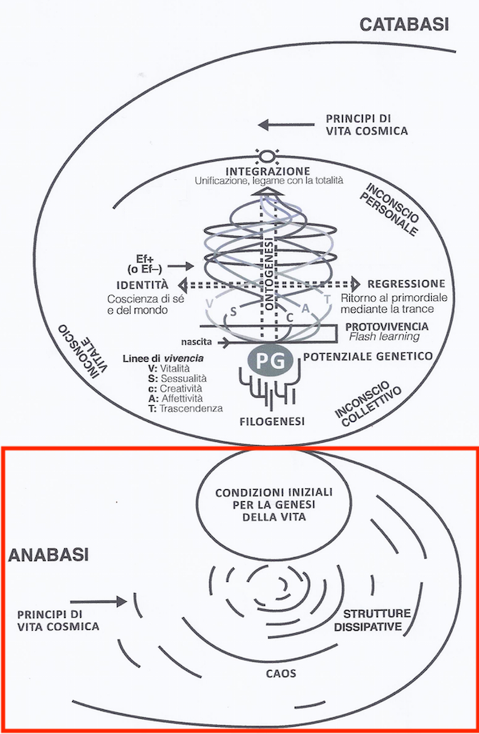
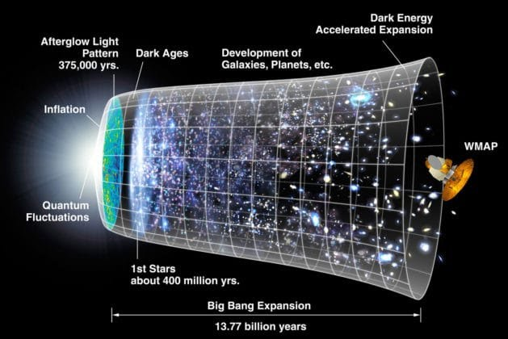
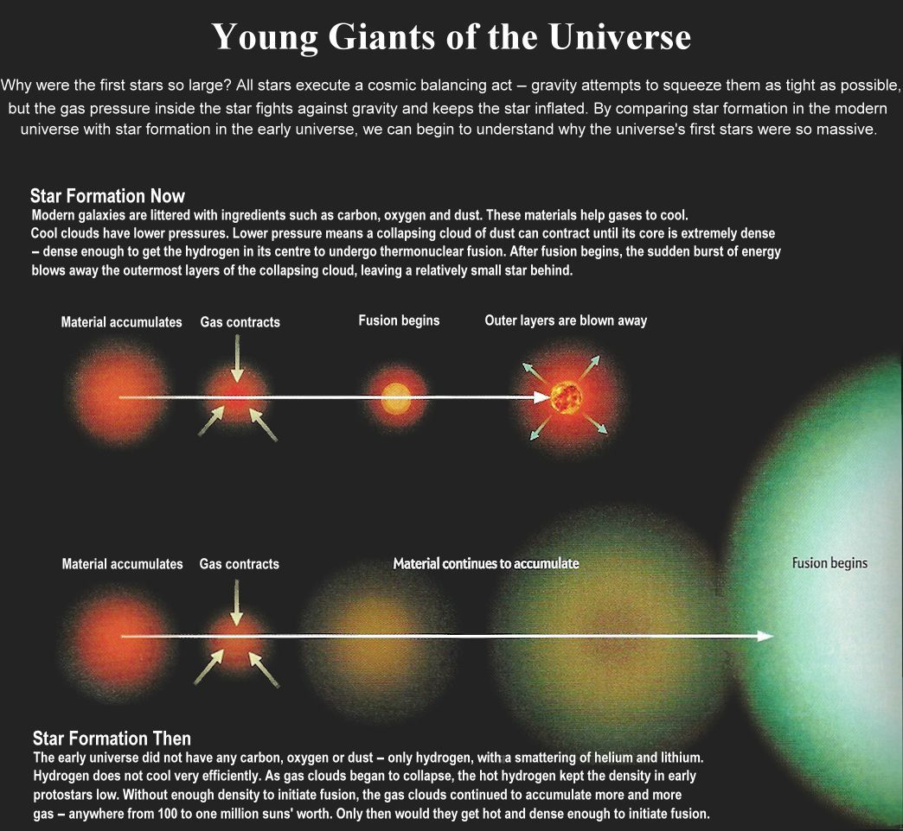
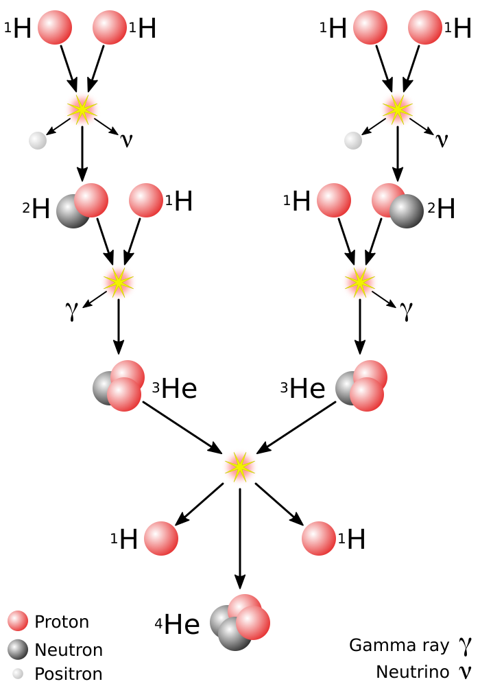
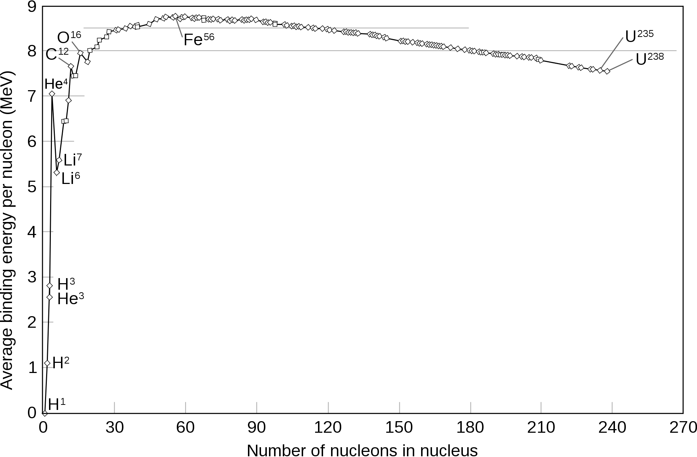
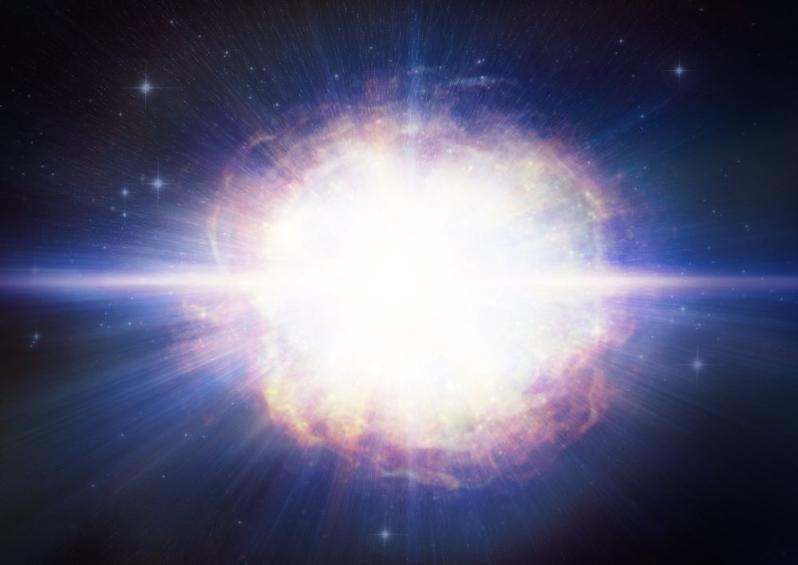
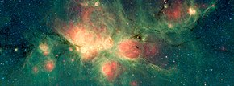
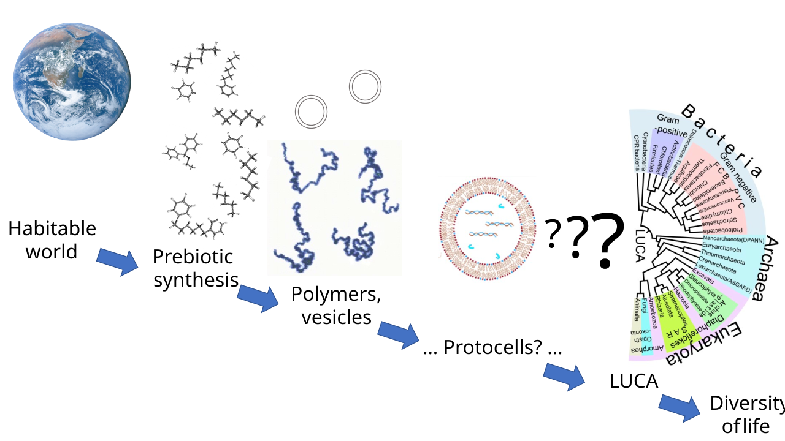

# Principes van het Kosmische Leven en de Genese van het Leven

De biologische aspecten vormen de verticale as van het Biodanza-Model. Onderaan het model komen we eerst de Principes van Kosmisch Leven en de Genese van het Leven tegen, die in Figuur \@ref(fig:modelCosmic) zijn aangeduid met het rode kader. 

```{r modelCosmic, fig.cap='Biodanza-Model met aanduiding van de Principes van het Kosmische Leven en de Genese van het Leven', out.width='50%', fig.asp=.8, fig.align='center', echo=FALSE}

```

We beginnen met het ontstaan van het universum en eindigen met het ontstaan van het biologische leven. Deze twee secties behandelen concepten uit de reader voor "Module IV: Biologische aspecten van Biodanza". 

## Ontstaan van het Universum

Figuur \@ref(fig:evolutionUniverse) geeft een overzicht van de evolutie van het heelal. 

```{r evolutionUniverse, fig.cap='Ontstaan en evolutie van ons heelal (Bron: NASA/WMAP Science Team, Wikipedia)', out.width='100%', fig.asp=.8, fig.align='center', echo=FALSE}

```

De meest gangbare theorie is dat onze kosmos begon met de oerknal. Een zeer energierijke staat.

Door de uitdijing koelde het heelal af waardoor een deel van de energie werd omgezet in waterstof en een fractie in zwaardere heliumkernen.


### Ontstaan van de Sterren

Onder invloed van de zwaartekracht begon de materie zich vervolgens te clusteren in nevels, gaswolken die hoofdzakelijk uit waterstof (H) en helium (He) bestonden.

Als gevolg van concentratieverschillen in deze eerste nevel trokken deze wolken zich verder samen en implodeerden ze uiteindelijk (zie Figuur \@ref(fig:genesisStar)). 

```{r genesisStar, fig.cap='Ontstaan van de eerste sterren (Bron: universe-review.ca)', out.width='100%', fig.asp=.8, fig.align='center', echo=FALSE}
#knitr::include_graphics("https://universe-review.ca/I08-13-firststars6.jpg")

```


Extreme verhitting in de nevel die door de zwaartekracht implodeerde, leidde tot een toestand waarin alle materie de vorm had van een superheet plasma. In zo'n plasma vindt spontaan kernfusie plaats. Bij dit proces worden lichte atomen gecombineerd tot zwaardere atomen en komt er veel energie vrij.

Eerst wordt in de kern van de ster waterstof omgezet in helium (zie Figuur \@ref(fig:nuclearFusion)). De massa van de resulterende heliumkernen is iets lager dan die van de oorspronkelijke waterstofkernen en het massaverschil wordt omgezet in energie. 

```{r nuclearFusion, fig.cap='Kernfusie van waterstof tot het zwaardere helium (Bron: Sarang, Wikipedia)', out.width='50%', fig.asp=.8, fig.align='center', echo=FALSE}

```

Als de waterstof in de kern van een ster is opgebruikt, valt de kernfusie daar stil, want om helium te laten fuseren is een veel hogere temperatuur nodig (Figuur \@ref(fig:fusionEnergy)).

```{r fusionEnergy, fig.cap='Energie die vrijkomt door kernfusie. In een ster vindt kernfusie plaats tot ijzer (Bron Wikipedia)', out.width='50%', fig.asp=.8, fig.align='center', echo=FALSE}

```

Zonder de energie van de kernfusie trekt de kern zich onder invloed van de zwaartekracht samen, waardoor hij nog heter wordt. Zodra de temperatuur hoog genoeg is, beginnen heliumkernen te fuseren tot koolstof en zuurstof. Bij sterren zoals onze zon houdt het daar op: aan het einde van hun leven stoten ze hun buitenlagen af als een kleurrijke nevel, en blijft er een kleine, hete kern over, een witte dwerg. In sterren die minstens acht keer zwaarder zijn dan de zon herhaalt dit proces zich telkens opnieuw, waarbij steeds zwaardere elementen worden gevormd, tot aan ijzer (Figuur \@ref(fig:fusionEnergy)). De fusie van ijzer levert echter geen energie meer op. Wanneer de kern uit ijzer bestaat, kan hij de zwaartekracht niet langer weerstaan en stort hij in een fractie van een seconde ineen. Die ineenstorting veroorzaakt een gigantische explosie: een supernova (zie Figuur \@ref(fig:supernova)). Daarbij worden de nieuw gevormde elementen in het universum geslingerd, en ontstaan bovendien elementen die nog zwaarder zijn dan ijzer. Zulke zware elementen worden ook gevormd wanneer twee neutronensterren, de ultracompacte restanten van ingestorte sterren, met elkaar botsen.

```{r supernova, fig.cap='Supernova van een ster (Bron:  www.universetoday.com)', out.width='50%', fig.asp=.8, fig.align='center', echo=FALSE}
#knitr::include_graphics("https://www.universetoday.com/wp-content/uploads/2020/04/hires.jpg")

```

Uit het materiaal dat sterren zo uitstoten, worden nieuwe nevels gevormd, die uiteindelijk leiden tot nieuwe sterren, en het hele proces begint opnieuw.

Door kernfusie in de sterren zijn dus de zwaardere atomen ontstaan waaruit uiteindelijk de biomoleculen van het leven worden opgebouwd. Wij zijn dus opgebouwd uit sterrenstof!

\newpage 

### Koolwaterstoffen in de Interstellaire Ruimte

Tijdens kernfusie in de sterren worden veel verschillende elementen gevormd. Voor biologisch leven zijn onder andere waterstof-, koolstof-, zuurstof-, zwavel-, fosfor- en stikstofatomen van cruciaal belang voor de samenstelling van organisch materiaal.

In de interstellaire ruimte reageert koolstof spontaan met andere elementen en vormt het polycyclische aromatische koolwaterstoffen (PAK's), ringvormige moleculen van koolstof en waterstof, vergelijkbaar met de moleculen in roet. Die zijn bijvoorbeeld zichtbaar op een foto van de Kattenpootnevel (Cat's Paw Nebula) (Figuur  \@ref(fig:catPawNebula)).  Het groene licht in de foto, is het gevolg van straling van hete sterren die fluorescentie van PAK's induceert. 

```{r catPawNebula, fig.cap='Kattenpootnevel, de groene gebieden zijn het gevolg van straling van hete sterren die fluorescentie van PAKs induceert. (Bron: NASA/JPL-Caltech, Wikipedia)', out.width='50%', fig.asp=.8, fig.align='center', echo=FALSE}

```    

PAK's konden ontstaan zodra de eerste sterren koolstof hadden gevormd en in de ruimte hadden verspreid. Laboratoriumexperimenten suggereren dat ze in de interstellaire ruimte, onder invloed van UV-straling en door reacties met onder meer waterstof, zuurstof en stikstof, verder kunnen worden omgezet tot voorlopers van aminozuren en nucleotiden, de bouwstenen van respectievelijk eiwitten en van RNA en DNA.

Dat de bouwstenen van het leven in de ruimte ontstaan, wordt ondersteund door wat we in ons eigen zonnestelsel vinden. Rond de komeet 67P/Tsjoerjoemov-Gerasimenko werd het aminozuur glycine gedetecteerd [@Altwegg2016]. En in stalen die de ruimtesonde OSIRIS-REx van de planetoïde Bennu naar de aarde bracht, vonden onderzoekers 14 van de 20 aminozuren die het leven op aarde gebruikt, én alle vijf de nucleobasen van DNA en RNA [@Glavin2025]. Omdat die stalen nooit met de aarde in contact kwamen, is besmetting door aards leven uitgesloten. De bouwstenen van het leven zijn dus geen aardse uitzondering: ze kunnen spontaan in de ruimte ontstaan.

Deze recente vondsten bevestigen wat Christian de Duve al in 2002 schreef: "Life is an obligatory manifestation of matter, written into the fabric of the universe" [@deDuve2002].  


## Ontstaan van het leven

In een uithoek van onze Melkweg, wat een modaal sterrenstelsel is, werd een modale planeet gevormd, die wij kennen als onze planeet Aarde. Nadat de aarde was afgekoeld, ontstond er vloeibaar water. De unieke eigenschappen van vloeibaar water zijn essentieel voor het biologische leven zoals wij dat kennen. Toen er eenmaal vloeibaar water beschikbaar was, ontstond het biologische leven in minder dan 300 miljoen jaar, wat een zeer kort tijdsinterval is op de geologische tijdschaal.

Zo waren er op aarde omstandigheden die het ontstaan van het biologische leven, zoals wij dat kennen, mogelijk maakten. Het exacte proces dat tot biologisch leven op aarde heeft geleid is niet gekend en dat zal waarschijnlijk zo blijven. Een algemene redenering wordt echter weergegeven in figuur \@ref(fig:originOfLife).

```{r originOfLife, fig.cap='Stadia in de oorsprong van het leven variëren van goed begrepen, zoals de abiotische synthese van eenvoudige organische moleculen, tot grotendeels onbekend, zoals de oorsprong van de laatste universele gemeenschappelijke voorouder (LUCA) met zijn complexe moleculaire functionaliteit. (Bron: Chiswick Chap, Wikipedia)', out.width='100%', fig.asp=.8, fig.align='center', echo=FALSE}

```  

Eerst was er een chemisch evolutieproces dat aan de basis lag van het ontstaan van organische moleculen met toenemende complexiteit. Volgens de meest gangbare hypothese, de RNA-wereldhypothese, speelden RNA-moleculen daarin een sleutelrol. RNA-moleculen kunnen immers zowel dragers zijn van genetische informatie als chemische reacties katalyseren. Onder zuurstofloze omstandigheden en in aanwezigheid van ijzer, zoals op de jonge aarde, kan RNA bovendien extra katalytische functies verwerven [@Williams2013]. In het laboratorium werd ook al aangetoond dat een RNA-molecule een ander functioneel RNA-molecule kan opbouwen uit losse bouwstenen [@Wochner2011], al is een RNA-molecule dat zichzelf volledig kan kopiëren nog niet gevonden. Of de eerste RNA-moleculen alleen evolueerden, of al vroeg samen met eiwitten of een eenvoudige stofwisseling, is nog een open vraag.

Vervolgens wordt aangenomen dat prebiotische moleculen, die zichzelf konden vermenigvuldigen, werden ingekapseld door fosfolipiden, die spontaan membraanachtige structuren vormen. Dit resulteerde in een protocel met een membraan (zie Figuur \@ref(fig:originOfLife)).
In deze protocellen was een verdere chemische evolutie mogelijk en dat gescheiden van de omgeving. Die evolutie leidde uiteindelijk tot een zelfreplicerende en zelforganiserende cel die was opgebouwd uit de vier essentiële soorten biomoleculen van het biologische leven: lipiden, koolhydraten, eiwitten en nucleïnezuren. 

Verdere biologische evolutie van deze eerste levende cellen leidde uiteindelijk tot onze laatste universele gemeenschappelijke voorouder (LUCA). Door de genen van hedendaagse bacteriën en archaea te vergelijken, kunnen wetenschappers reconstrueren welke genen LUCA al moet hebben gehad. Een eerste studie vond 355 eiwitfamilies die tot LUCA teruggaan [@Weiss2016]. Een recentere analyse schat dat LUCA ongeveer 4,2 miljard jaar geleden leefde en een genoom had met zo'n 2600 eiwitten, vergelijkbaar met dat van hedendaagse bacteriën [@Moody2024]. LUCA was dus al een complexe cel. Het bewaarde zijn erfelijk materiaal in DNA, gebruikte dezelfde genetische code als wij, en maakte in ribosomen eiwitten aan op basis van RNA-sjablonen. LUCA leefde zonder zuurstof (anaëroob) en haalde zijn energie vermoedelijk uit waterstof en CO$_2$ in een geochemisch actieve omgeving, zoals hydrothermale bronnen op de oceaanbodem [@Weiss2016]. Bovendien leefde LUCA waarschijnlijk niet geïsoleerd, maar maakte het deel uit van een ecosysteem met andere micro-organismen [@Moody2024]. Uiteindelijk evolueerde LUCA naar alle soorten die momenteel op aarde leven.

Nu we hebben stilgestaan bij het ontstaan van het leven, kunnen we ons concentreren op de fylogenese of het verhaal van de evolutie van LUCA tot alle soorten van de levensboom.  
