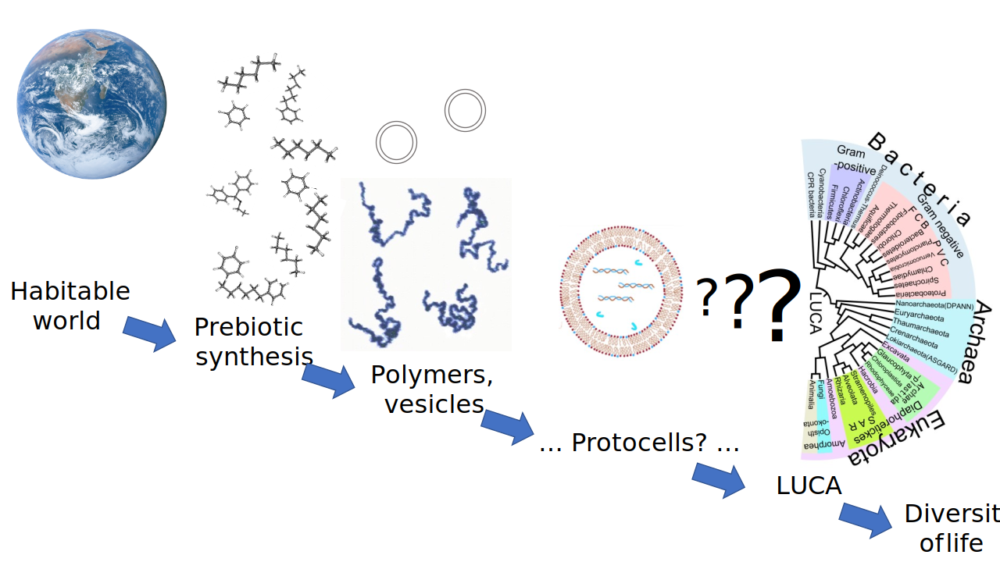

# Principes van het Kosmische Leven en de Genese van het Leven

De biologische aspecten vormen de verticale as van het Biodanza-Model. Onderaan het model komen we eerst de Principes van Kosmisch Leven en de Genese van het Leven tegen, die in Figuur \@ref(fig:modelCosmic) zijn aangeduid met het rode kader. 

```{r modelCosmic, fig.cap='Biodanza-Model met aanduiding van de Principes van het Kosmische Leven en de Genese van het Leven', out.width='50%', fig.asp=.8, fig.align='center', echo=FALSE}
knitr::include_graphics("./figs/biologischeAspectenBiodanzaDeelI.png")
```

We beginnen met het ontstaan van het universum en eindigen met het ontstaan van het biologische leven. Deze twee secties behandelen concepten uit de reader voor "Module IV: Biologische aspecten van Biodanza". 

## Ontstaan van het Universum

Figuur \@ref(fig:evolutionUniverse) geeft een overzicht van de evolutie van het heelal. 

```{r evolutionUniverse, fig.cap='Ontstaan ​​en evolutie van ons heelal (Bron: NASA/WMAP Science Team, Wikipedia)', out.width='100%', fig.asp=.8, fig.align='center', echo=FALSE}
knitr::include_graphics("./figs/originKosmos.jpg")
```

De meest gangbare theorie is dat onze kosmos begon met de oerknal. Een zeer energierijke staat.

Door de uitdijing koelde het heelal af waardoor een deel van de energie werd omgezet in waterstof en een fractie in zwaardere heliumkernen.


### Ontstaan van de Sterren

Onder invloed van de zwaartekracht begon de materie zich vervolgens te clusteren in nevels, gaswolken die hoofdzakelijk uit waterstof (H) en helium (He) bestonden.

Als gevolg van concentratieverschillen in deze eerste nevel trokken deze wolken zich verder samen en implodeerden ze uiteindelijk (zie Figuur \@ref(fig:genesisStar)). 

```{r genesisStar, fig.cap='Ontstaan van de eerste sterren (Bron: universe-review.ca)', out.width='100%', fig.asp=.8, fig.align='center', echo=FALSE}
#knitr::include_graphics("https://universe-review.ca/I08-13-firststars6.jpg")
knitr::include_graphics("./figs/I08-13-firststars6.jpeg")
```


Extreme verhitting in de nevel die door de zwaartekracht implodeerde, leidde tot een toestand waarin alle materie de vorm had van een superheet plasma. In zo'n plasma vindt spontaan kernfusie plaats. Bij dit proces worden lichte atomen gecombineerd tot zwaardere atomen en komt er veel energie vrij.

Eerst worden alle waterstofatomen omgezet in helium (zie Figuur \@ref(fig:nuclearFusion)). De massa van de resulterende heliumkernen is iets lager dan die van de oorspronkelijke waterstofkernen en het massaverschil wordt omgezet in energie. 

```{r nuclearFusion, fig.cap='Kernfusie van waterstof tot het zwaardere helium (Bron: Sarang, Wikipedia)', out.width='50%', fig.asp=.8, fig.align='center', echo=FALSE}
knitr::include_graphics("./figs/fusion.svg")
```

Als alle waterstof in een ster is opgebruikt, stopt de fusie omdat de activeringsenergie om helium in lithium om te zetten te hoog is (Figuur \@ref(fig:fusionEnergy)).

```{r fusionEnergy, fig.cap='Energie die vrijkomt door kernfusie. In een ster vindt kernfusie plaats tot ijzer (Bron Wikipedia)', out.width='50%', fig.asp=.8, fig.align='center', echo=FALSE}
knitr::include_graphics("./figs/fusionEnergy.png")
```

Daarom koelt de ster af, implodeert ze waardoor het nog warmer wordt. Hierdoor kan de activatie energie van helium naar lithium worden overschreden en vindt spontaan kernfusie plaats van de zwaardere elementen tot ijzer (Figure \@ref(fig:fusionEnergy)). Er komt hierbij zoveel energie vrij dat de ster explodeert tot een supernova (zie Figuur \@ref(fig:supernova)). Tijdens de supernova worden deze nieuw gevormde elementen in het universum geslingerd.

```{r supernova, fig.cap='Supernova van een ster (Bron:  www.universetoday.com)', out.width='50%', fig.asp=.8, fig.align='center', echo=FALSE}
#knitr::include_graphics("https://www.universetoday.com/wp-content/uploads/2020/04/hires.jpg")
knitr::include_graphics("./figs/hires.jpeg")
```

Uit supernova worden nieuwe nevels gevormd en deze zullen uiteindelijk leiden tot nieuwe sterren en het hele proces begint van vooraf aan.

Door kernfusie in de sterren zijn dus de zwaardere atomen ontstaan waaruit uiteindelijk de biomoleculen van het leven worden opgebouwd. Wij zijn dus opgebouwd uit sterrenstof!

\newpage 

### Koolhydraten in de Interstellaire Ruimte

Tijdens kernfusie in de sterren worden veel verschillende elementen gevormd. Voor biologisch leven zijn onder andere waterstof-, koolstof-, zuurstof-, zwavel-, fosfor- en stikstofatomen van cruciaal belang voor de samenstelling van organisch materiaal.

In de interstellaire ruimte reageert koolstof spontaan met andere elementen en vormt het poly-aromatische koolhydraten (PAK's). Die zijn bijvoorbeeld zichtbaar op een foto van de Cat's Paw nebula (Figuur  \@ref(fig:catPawNebula)).  Het groene licht in de foto, is het gevolg van straling van hete sterren die fluorescentie van PAK's induceert. 

```{r catPawNebula, fig.cap='Cats Paw nebula, de groene gebieden zijn het gevolg van straling van hete sterren die fluorescentie van PAKs induceert. (Source: NASA/JPL-Caltech, Wikipedia)', out.width='50%', fig.asp=.8, fig.align='center', echo=FALSE}

```    

PAK’s ontstonden al kort na de oerknal. Zodra ze zijn geproduceerd, worden ze verder getransformeerd in de interstellaire ruimte door reactie met onder meer waterstof en zuurstof, om precursormoleculen ("voorlopers") te vormen voor aminozuren en nucleotiden, die de respectievelijke bouwstenen zijn van eiwitten, en van RNA en DNA. Deze bouwstenen zijn essentieel voor de chemie van het leven en zijn dus al alomtegenwoordig in de ruimte.

Dit, naast andere argumenten, was voor Christian de Duve de aanleiding voor zijn citaat: "Life is an obligatory manifestation of matter, written into the fabric of the universe" [@deDuve2002].  


## Ontstaan van het leven

In een uithoek van onze Melkweg, wat een modaal sterrenstelsel is, werd een modale planeet gevormd, die wij kennen als onze planeet Aarde. Nadat de aarde was afgekoeld, ontstond er vloeibaar water. De unieke eigenschappen van vloeibaar water zijn essentieel voor het biologische leven zoals wij dat kennen. Toen er eenmaal vloeibaar water beschikbaar was, ontstond het biologische leven in minder dan 300 miljoen jaar, wat een zeer kort tijdsinterval is op de geologische tijdschaal.

Zo waren er op aarde omstandigheden die het ontstaan van het biologische leven, zoals wij dat kennen, mogelijk maakten. Het exacte proces dat tot biologisch leven op aarde heeft geleid is niet gekend en dat zal waarschijnlijk zo blijven. Een algemene redenering wordt echter weergegeven in figuur \@ref(fig:originOfLife).

```{r originOfLife, fig.cap='Stadia in de oorsprong van het leven variëren van goed begrepen, zoals de abiotische synthese van eenvoudige organische moleculen, tot grotendeels onbekend, zoals de oorsprong van de laatste universele gemeenschappelijke voorouder (LUCA) met zijn complexe moleculaire functionaliteit. (Bron: Chiswick Chap, Wikipedia)', out.width='100%', fig.asp=.8, fig.align='center', echo=FALSE}

```  

Eerst was er een chemisch evolutieproces die aan de basis lag van het ontstaan van organische moleculen met toenemende complexiteit. Het is een algemene consensus dat RNA-moleculen het eerst uit vrije nucleotiden voortkwamen. RNA-moleculen kunnen zowel katalytisch zijn alsook dragers van genetische informatie. Ze kunnen zichzelf ook vermenigvuldigen onder anoxische omstandigheden (in afwezigheid van zuurstof) en in aanwezigheid van ijzer, omstandigheden zoals op de jonge planeet Aarde (b.v. @Williams2013). Deze RNA-moleculen evolueerden ofwel alleen, volgens de RNA-wereldhypothese, ofwel al in combinatie met eiwitten.

Vervolgens wordt aangenomen dat prebiotische moleculen, die zichzelf konden vermenigvuldigen, werden ingekapseld door fosfolipiden, die spontaan membraanachtige structuren vormen. Dit resulteerde in een protocel met een membraan (zie Figuur \@ref(fig:originOfLife)).
In deze protocellen was een verdere chemische evolutie mogelijk en dat gescheiden van de omgeving. Die evolutie leidde uiteindelijk tot een zelfreplicerende en zelforganiserende cel die was opgebouwd uit de vier essentiële soorten biomoleculen van het biologische leven: lipiden, koolhydraten, eiwitten en nucleïnezuren. 

Verdere biologische evolutie van deze eerste levende cellen leidde uiteindelijk tot onze laatste universele gemeenschappelijke voorouder (LUCA). LUCA moet minstens 355 genen hebben gehad, die alle levende organismen gemeen hebben. LUCA was anaëroob, leefde in de afwezigheid van zuurstof; behield zijn erfelijk materiaal met behulp van DNA, de genetische code; en - produceerde eiwitten uit RNA-sjablonen in ribosomen. LUCA haalde zijn energie uit oceanische vulkanische activiteit in diepzeeopeningen, de intens hete pluimen van zeewater dat in contact komt met magma dat door de oceaanbodem uitbarst. En uiteindelijk evolueerde LUCA naar alle soorten die momenteel op aarde leven.

Nu we hebben stilgestaan bij het ontstaan van het leven, kunnen we ons concentreren op de fylogenes of het verhaal van de evolutie van LUCA tot alle soorten van de levensboom.  
