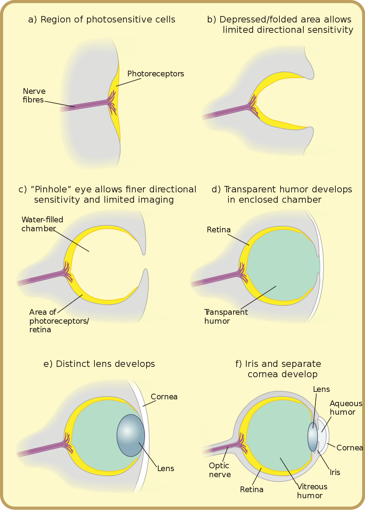

# Fylogenese en Evolutie

In het midden van het Biodanza-Model in Figuur \@ref(fig:modelPhylo) zien we het Biologisch Aspect "fylogenese"  aangeduid in het rode kader. 

```{r modelPhylo, fig.cap='Model of Biodanza and Phylogenesis', out.width='50%', fig.asp=.8, fig.align='center', echo=FALSE}
knitr::include_graphics("./figs/biologischeAspectenBiodanzaDeelII.png")
```

Fylogenese is het biologische proces of evolutionaire mechanisme waardoor een soort of een groep soorten verschijnt. Dit concept was erg belangrijk voor Rolando Toro, omdat het laat zien hoe verwant alle biologische organismen zijn en hoe natuurlijk het is dat hun levens allemaal volgens dezelfde principes zijn gestructureerd.

Voor Rolando ging de evolutie verder dan de biologische evolutie. Volgens hem bestaat het leven in essentie uit twee belangrijke processen: Anabasis en Katabasis, waaruit alle structuren in het universum zijn ontstaan. Anabasis is de integratie van chaos naar zelforganiserende systemen, terwijl Katabasis verwijst naar de desintegratie van dergelijke systemen. Bij Katabasis ontstaat echter onmiddellijk de kiem van nieuw leven. 

Tijdens de evolutie van het heelal ontstonden er steeds complexere structuren. Dit impliceert echter niet dat de evolutie een richting heeft. Dat evolutie steeds van het "eenvoudige" naar het "hogere of meer complexe" gaat, is een wijdverspreide verwarring. In plaats daarvan kunnen we deze twee organisatieprincipes zien als een creatief proces dat leidt tot het genereren van nieuwe structuren; sommige zijn meer eenvoudig, terwijl andere complexer zijn; en ze hebben allemaal hun eigen ritme en unieke kosmische dans. Dus de essentie van evolutie is de rijkdom en diversiteit die ontstaat.

Volgens Rolando worden alle structuren in het universum gevormd door dezelfde principes: aantrekking en afstoting. De expressie van deze principes verschilt echter telkens dat een nieuwe structuur ontstaat en ze varieert ook in complexiteit. Aantrekking en afstoting kunnen inderdaad worden waargenomen vanaf een eenvoudig atoom tot op het niveau van sterrenstelsels; en bij biologische levensvormen zijn aantrekking en afstoting verder gedifferentieerd in

- positieve and negatieve fototaxis^[Fototaxis: beweging en/of groei naar of weg van licht], geotaxis^[Geotaxis: beweging en/of groei als reactie op een zwaartekrachtveld] en chemotaxis^[Chemotaxis: beweging en/of groei naar of weg van een chemische of biochemische concentratiegradiënt], 
- reflexen, eenvoudige reacties op stimuli
- instincten,
- emoties, tot
- gevoelens.

Dat alles is essentieel voor ons om in homeostase^[Homeostase: zelfregulerend proces waardoor een organisme de neiging heeft zijn stabiliteit en intern evenwicht in zijn steeds veranderende omgeving te behouden] te kunnen blijven terwijl we ons aanpassen aan omstandigheden die het beste zijn voor onze overleving.

Interessant is dat  @margulis1999 zei dat "metaboliserende oerbacteriën zo efficient waren in het opnieuw maken van zichzelf (...) dat het binnenste van onze cellen vandaag de dag chemisch gezien meer verwant is aan de externe omgeving van de vroege aarde, waarin het biologische leven ontstond, dan dat ze lijken op onze huidige zuurstofrijke wereld. Het leven is inderdaad sinds het begin en zonder enige discontinuïteit chemisch verbonden geweest met zijn verleden". @margulis1999 gaat verder dat "het metabolische geheugen van moderne cellen hoogstwaarschijnlijk dateert van vóór de meeste oude gesteenten". Het geheugen kan dus worden gezien als een intrinsieke eigenschap van biologische systemen en hun metabolische arsenaal is een weerspiegeling van de omgevingen waaraan ze zijn blootgesteld tijdens hun evolutionaire traject.

Volgens Rolando is de differentiatie van autonomie een ander belangrijk aspect van de evolutie. Autonomie geeft een organisme het vermogen om te reageren, om homeostase te handhaven, en dus het vermogen om te integreren met zijn externe omgeving zonder zijn identiteit te verliezen. De differentiatie van autonomie wordt weerspiegeld in de differentiatie van het (a) sensorisch-motorische, (b) immuun- en (c) cognitieve en communicatieve arsenaal van een organisme, waardoor het respectievelijk (a) de plasticiteit krijgt om zich aan te passen, (b) het vermogen heeft om zijn biologische integriteit te behouden door te herkennen wat endogeen^[Endogeen: eigen] en vreemd is, en (c) het vermogen heeft om andere leden van zijn eigen soort te herkennen en ermee om te gaan. Deze drie belangrijke functies werden al vervuld door een aantal verschillende groepen eiwitten in bacteriën en evolueerden naar totaal aparte en complexe systemen in planten en dieren.

Daarom is het uiterst waardevol om te bestuderen wat alle biologisch leven gemeen heeft, zodat we onszelf beter kunnen begrijpen en ons (opnieuw) verbonden en verenigd kunnen voelen met het biologische leven en het hele universum.

We beginnen dit hoofdstuk met twee secties die meer technisch zijn en zich richten op de concepten gerelateerd aan Fylogenese en Evolutie zoals geïntroduceerd in de reader van de Biodanza lerarenopleiding “Module IV: Biologische aspecten van Biodanza”. We sluiten dit hoofdstuk af met een meer filosofisch gedeelte over evolutie, de mensheid en Biodanza.

## Fylogenese

Alle soorten zijn voortgekomen uit dezelfde voorouderlijke populatie van cellen. Dit wordt ook wel dezelfde Last Universal Common Ancestor (LUCA) genoemd. In de levensboom worden de evolutionaire relaties tussen verschillende organismen (en groepen van organismen) samengevat. Alle levende wezens zijn uiteindelijk terug te voeren op LUCA die zich aan de wortel van de boom bevindt, zie Figuur \@ref(fig:treeOfLifeBis).

```{r treeOfLifeBis, fig.cap='We hernemen hier de figuur van de levensboom. Het is één van de meest belangrijke organiserende principes in de biologie. Het toont de evolutionaire relaties tussen verschillende organismen en dat alle levende wezens uiteindelijk terug te voeren zijn op de laatste universele gemeenschappelijke voorouder die zich aan de wortel van de boom bevindt (Bron: wikipedia)', out.width='100%', fig.asp=.8, fig.align='center', echo=FALSE}
knitr::include_graphics("./figs/Phylogenetic_tree.svg")
```

Fylogenese is het proces van het ontstaan van alle soorten uit de levensboom vertrekkende van LUCA.

Rolando Toro noemt de oorsprong van soorten en aanpassing aan de omgeving evolutionaire differentiatie. Hij beschouwt de genetische informatie van een soort als een logboek van de omgevingen en evolutionaire ontwikkeling die het tot nu toe heeft ondergaan.


### Tijdschaal

<!--  -->


| 4.5 BYA | 4.3 BYA | 3.8 BYA | 3.5 BYA | 540 MYA | 520 MYA |
|---------|---------|---------|---------|---------|---------|
|         |         |         |         |         |         |

(Source: naturedocumetaries.org)


Bij haar oorsprong, ongeveer 4,5 miljard jaar geleden (BYA), was de aarde zwart, een hete basaltrots en stof in een koud vacuüm. Toen de aarde afkoelde, werd ze Grijze Aarde (4.3 BYA), omdat ze voornamelijk bedekt was met graniet en rotsen. Nog eens 500 miljoen jaar later was ze bedekt met vloeibaar water: Blauwe Aarde (3,8 BYA).

In slechts 300 miljoen jaar veranderde ze door het ontstaan van biologische leven radicaal in Rode Aarde (3,5 BYA). Er zijn inderdaad cyanobacteriën ontstaan die aan fotosynthese kunnen doen en die massaal zuurstof zijn gaan produceren, een zeer reactief molecule. Dit leidde ertoe dat al het vrije ijzer in de oceaan neersloeg als ijzeroxide of roest (rood). Er vond een explosie plaats van het aantal mineraalsoorten. Hun aantal ging van ongeveer 250 naar ruim 5000 soorten. Zuurstof veroorzaakte ook een massale sterfte omdat slechts weinig organismen met het zeer reactieve karakter van zuurstof om konden gaan. De komende drie miljard jaar bleef het leven op aarde relatief gelijk.

Rond 540 MYA werd de aarde getroffen door een grote ijstijd, de Witte Aarde. Opnieuw leidde dit tot een massale uitsterving als gevolg van de kou. De vulkanische activiteit kwam echter te hulp door broeikasgassen te produceren en een atmosfeer te creëren die meer warmte vast kon houden.

In minder dan 20 miljoen jaar (MY) veranderde de aarde opnieuw radicaal in Groene Aarde (520 MYA). Er vond een explosie van leven plaats en het biologische leven evolueerde plotseling van voornamelijk eencellig naar complexe meercellige biologische levensvormen.


## Evolutie

Hoe heeft de evolutie van LUCA naar alle soorten van de levensboom plaatsgevonden?

Lamarck (1744 - 1829) was een van de eerste voorgangers van biologische evolutie. Hij stelde de theorie voor dat (a) organismen hun gedrag veranderden als reactie op veranderingen in de omgeving, dat (b) hun veranderde gedrag op hun beurt hun organen veranderde, en dat (c) hun nakomelingen die ‘verbeterde’ structuren erfden. Een theorie die is verlaten ten gunste van de evolutietheorie door natuurlijke selectie van Darwin (1809 - 1882) en Wallace (1823 - 1913). Voor hen bleven de mechanismen van reproductieve erfelijkheid en de oorsprong van nieuwe eigenschappen echter een mysterie. Bij de herontdekking van het werk van Mendel (1822 - 1884), die de basis legde voor populatiegenetica, werden natuurlijke selectie en populatiegenetica gecombineerd in de neodarwinistische theorie of de synthetische evolutietheorie. Sleutelprincipes in deze theorie zijn variabiliteit en selectie.

Het baanbrekende werk van Margulis (1938–2011) werpt echter een nieuw licht op de evolutie. Volgens haar theorie is symbiose een andere belangrijke motor van evolutie. Symbiose is een nauwe, langdurige associatie tussen twee of meer verschillende biologische soorten waarbij de betrokken soorten allemaal voordeel hebben van hun interactie. Vooral haar theorie van sequentiële endosymbiose, waarbij verschillende soorten bacteriën samensmolten om grotere en complexere cellen te vormen, kan de plotselinge explosie van levensvormen verklaren die werd waargenomen tussen 540 MYA en 520 MYA.

In deze paragraaf concentreren we ons eerst op de principes van variatie en selectie. We gaan dan verder met endosymbiose en symbiogenese. We sluiten dit deel af met een uitwerking van het concept teleonomie.

### Variabiliteit en Selectie

Variatie ontstaat onder meer door fouten in het kopiëren van DNA voor de celdeling van prokaryotische cellen en de productie van gameten^[Gameet: sperma- of eicel] voor eukaryotische cellen (zie Figuur  \@ref(fig:dnaPolymerase)). 

```{r dnaPolymerase, fig.cap='Kopiëren van DNA door DNA-polymerase. DNA-polymerase verlengt een DNA-streng door een complementair nucleoside-tri-fosfaat op te nemen en twee van de drie fosfaatgroepen te splitsen. Let opnieuw op het verband tussen energie en informatie. Fouten worden vaak gecorrigeerd door proeflezen. Sommige fouten blijven echter bestaan.', out.width='45%', fig.asp=.8, fig.align='center', echo=FALSE}
knitr::include_graphics("./figs/DNA_polymerase.svg")
```

```{r, eval=knitr::is_html_output(excludes = "epub"), results = 'asis', echo = F}
cat('
</br>'
)
```

De foutmarge bij DNA-replicatie bedraagt 1 fout per miljard basenparen die worden gekopieerd, wat tot puntmutaties kan leiden. Merk op dat wij mensen een genoomgrootte hebben van ongeveer 6,4 miljard basenparen.

Andere bronnen van variabiliteit zijn

- Inserties of deleties, dat wil zeggen basenparen die respectievelijk worden toegevoegd of verwijderd.
- Recombinatie, herschikking van genetische eigenschappen, bijvoorbeeld tijdens seksuele voortplanting

De meeste mutaties zijn neutraal, dat wil zeggen dat het gemuteerde codon codeert voor hetzelfde aminozuur. Neutrale mutaties kunnen worden gebruikt als een moleculaire/genetische klok om te bepalen hoe ver twee soorten in evolutionaire zin van elkaar verwijderd zijn.

Maar mutaties zijn niet altijd neutraal! Sikkelcelanemie wordt bijvoorbeeld veroorzaakt door één puntmutatie in hemoglobine (zie Figuur \@ref(fig:sickleCell1) en \@ref(fig:sickleCell2)). Een T (thyminebase) wordt gemuteerd naar een A (adeninebase), wat resulteert in een codon dat codeert voor het aminozuur valine in plaats van glutaminezuur. Dit veroorzaakt drastische veranderingen in de 3D-structuur van het hemoglobine-eiwit en veroorzaakt een vervorming van de rode bloedcellen van een ronde naar sikkelvorm, wat leidt tot bloedarmoede.

Waarom blijft deze mutatie bestaan? Het komt vooral voor in Afrika, waar de mutatie voor sikkelcelanemie wordt geselecteerd omdat het de getroffen individuen resistent maakt tegen malaria. Dat geeft hen ondanks hun bloedarmoede toch een evolutionair concurrentievoordeel. Nakomelingen die de mutatie van beide ouders erven, zijn echter niet levensvatbaar. Daarom blijft ook de reguliere variant van hemoglobine bestaan.
 
```{r sickleCell1,  fig.cap='Mutatie van hemoglobine bij patiënten met sikkelcelanemie (Bron: Wikipedia)', out.width='45%', fig.asp=.8, fig.align='center', echo=FALSE}
knitr::include_graphics("./figs/sickleCellWikipedia2.png")
```

```{r sickleCell2,  fig.cap='Misvormde rode bloedcellen bij patiënten met sikkelcelanemie (Bron: Wikipedia)', out.width='45%', fig.asp=.8, fig.align='center', echo=FALSE}
knitr::include_graphics("./figs/Sickle_Cell_Anemia_wiki3.png")
```


Evolutie is dus een natuurlijk proces dat wordt aangedreven door twee tegengestelde krachten: variatie en selectie.

Variatie ontstaat onder andere door spontane kopieerfouten in genetische code of mutaties.

Selectie vindt plaats op basis van ecofactoren: is een mutatie gunstig of schadelijk voor een bepaald organisme in zijn specifieke omgeving? De kans op fixatie van de mutatie hangt dus af van het reproductiesucces.

Het proces van genetische variatie en selectie kan uiteindelijk na vele generaties leiden tot de evolutie van nieuwe soorten.


### Genetische Drift 

Een ander belangrijk proces voor het ontstaan van soorten is genetische drift. Dit zijn willekeurige fluctuaties van allelen, dit zijn specifieke sequentievarianten van een gen. Genetische drift is vooral sterk in kleine populaties. In tegenstelling tot selectie is het niet adaptief.

Nieuwe soorten zullen dus sneller ontstaan wanneer een klein deel van de populatie geïsoleerd raakt in een nieuwe omgeving.


### Horizontale Genoverdracht

Horizontale genoverdracht of de niet-seksuele overdracht van genetische informatie tussen twee verschillende organismen is ook belangrijk voor het evolutionaire proces.

Dit komt veel voor bij Prokaryota, dat wil zeggen eubacteriën en archaea-bacteriën, denk maar aan de superbacteriën in ziekenhuizen die resistentie hebben verworven tegen meerdere vormen van antibiotica. Het komt ook voor tussen Eukaryota. Vooral bij protisten, eencellige organismen met een kern. Evenals tussen Prokaryota enerzijds en Eukaryota anderzijds.

### Endosymbiose

Eldredge en Gould hebben aangetoond dat het fossielenbestand aangeeft dat de evolutie in uitbarstingen plaatsvindt: meestal gaat het langzaam totdat er in korte tijd plotseling snelle veranderingen optreden [@margulis1999]. Volgens Margulis kan dit worden verklaard door endosymbiose, waarbij de ene soort binnen een andere soort gaat leven. Dat is een bron van evolutionaire vernieuwing die aanleiding kan geven tot een explosie van nieuwe levensvormen.

Er bestaan twee archetypen van cellen:

- Prokaryota, alle bacteria en archaebacteria, die zijn ééncellig en bestaan uit een eenvoudige cel met een grootte van 0,1 tot 5,0 $\mu m$ met DNA dat vrij in het celcytosol (de vloeistof in de cel) ligt, zie Figuur \@ref(fig:prokaryotaCell) en

```{r prokaryotaCell, fig.cap=' Diagram van een typische prokaryote cel. De cel is eenvoudig, het DNA ligt vrij in de cel (Bron: Ali Zifan, Wikipedia)', out.width='50%', fig.asp=.8, fig.align='center', echo=FALSE}
knitr::include_graphics("./figs/prokaryoteCell.svg")
```

- Eukaryota, protisten, schimmels, planten en dieren, die zijn ééncellig of meercellig en hebben grotere en meer complexe cellen, 10-100 $\mu m$ groot. Ze hebben interne membraangebonden structuren, organellen genaamd, en een cytoskelet, die een belangrijke rol spelen bij het de organisatie en vorm van de cel. Eukaryotisch DNA wordt opgeslagen in chromosomen. Een chromosoom is een lang DNA-molecule dat in compacte vorm is opgeslagen. Een chromosoom bevat een deel of al het genetische materiaal van een organisme. Menselijke cellen hebben 46 chromosomen, dat wil zeggen 23 chromosoomparen. Elk paar bestaat uit één exemplaar van onze biologische moeder en één exemplaar van onze biologische vader. De chromosomen bevinden zich in de celkern, het organel dat de integriteit van de chromosomen en dus van onze genen in stand houdt, en speelt een belangrijke rol bij de regulatie van genexpressie en van de activiteit van de cel. Zie Figuren \@ref(fig:animalCell) and \@ref(fig:plantCell).


```{r animalCell, fig.cap='Diagram van een typische dierlijke cel. Dierlijke cellen zijn eukaryotische cellen. Ze zijn doorgaans veel groter dan die van prokaryoten. Ze hebben interne membraangebonden structuren, organellen genaamd, en een cytoskelet, die een belangrijke rol spelen bij de organisatie en vorm van de cel. Eukaryoot DNA is verdeeld in chromosomen, die zich in de celkern bevinden, het organel dat de integriteit van genen handhaaft, en een belangrijke rol speelt bij de regulatie van genexpressie en van de activiteit van de cel. (Bron:  Mariana Ruiz Villarreal, Wikipedia)', out.width='50%', fig.asp=.8, fig.align='center', echo=FALSE}
knitr::include_graphics("./figs/animalCell.svg")
```

```{r plantCell, fig.cap='Diagram van een typische plantencel. Plantcellen zijn eukaryotische cellen. Ze zijn doorgaans veel groter dan die van prokaryoten. Ze hebben interne membraangebonden structuren, organellen genaamd, en een cytoskelet, die een belangrijke rol spelen bij de organisatie en vorm van de cel. Eukaryoot DNA is verdeeld in chromosomen, die zich in de celkern bevinden, het organel dat de integriteit van genen handhaaft, en een belangrijke rol speelt bij de regulatie van genexpressie en de activiteit van de cel. Plantencellen hebben ook een celwand en bladgroenkorrels die aan fotosynthese kunnen doen. (Bron:  Mariana Ruiz Villarreal, Wikipedia)', out.width='50%', fig.asp=.8, fig.align='center', echo=FALSE}
knitr::include_graphics("./figs/plantCell.svg")
```


Van 3,5 BYA - 540 MYA vindt men voornamelijk prokaryotische en enkele eenvoudige eukaryote organismen in fossielen en was het leven voornamelijk eencellig.

De sequentiële endosymbiosetheorie (SET) van Margulis stelt dat eukaryote cellen werden gegenereerd door endosymbiose, dat is een symbiotische relatie waarbij het ene organisme in het andere begon te leven, wat gunstig is voor beide organismen. Het proces van sequentiële endosymbiose dat leidde tot eukaryote cellen wordt weergegeven in Figuur \@ref(fig:endosymbiosis). 

```{r endosymbiosis, fig.cap='Ontstaan van eukaryote cellen (Bron: wikipedia)', out.width='80%', fig.asp=.8, fig.align='center', echo=FALSE}
knitr::include_graphics("./figs/endosymbiosis.svg")
```

Er wordt aangenomen dat eerst een anaerobe^[Anaeroob: leven in afwezigheid van zuurstof] prokaryote cel was gegroeid en membraansystemen in de cel had ontwikkeld, wat aanleiding gaf tot de vorming van de kern^[Merk op dat volgens Margulis de grote anaërobe cel met een kern, de eerste eukaryoot, al het resultaat was van een eerdere endosymbiotische gebeurtenis. Er bestaat echter nog geen wetenschappelijke consensus over deze hypothese.]. 
 Op een gegeven ogenblik moet deze grote prokaryotische cel met interne membraansystemen een aërobe^[Aëroob: zuurstofgebruik en ademhaling met zuurstof, dat levert meer energie op] proteobacterie hebben opgeslokt, die erin slaagde om niet te worden gemetaboliseerd. De twee cellen begonnen met een endosymbiotische relatie.

De opgeslokte proteobacterium voorzag de gastheercel van extra energie door koolhydraten en lipiden te metaboliseren met behulp van zuurstof en de gastheercel voedde de proteobacterium met deze biomoleculen. Dit gaf het endosymbiotische paar de mogelijkheid om verder in omvang te groeien en te gedijen in de zuurstofrijke omgeving van planeet Aarde die ontstond tijdens het Cambrium-tijdperk dat 540 miljoen jaar geleden begon. Aangenomen wordt dat de toename van zuurstof één van de belangrijkste triggers is die aanleiding gaf tot de ‘biologische oerknal’ die leidde tot een explosie van nieuwe soorten en de opkomst van alle grote groepen^[Grote groepen van een koninkrijk worden meer formeel *phyla* genoemd] in het dierenrijk [@he2019].  

Tijdens hun endosymbiotische evolutie droeg de proteobacterium geleidelijk veel genen over aan de celkern, en kwam onder regulatie van de kern te staan. Uiteindelijk evolueerde de proteobacterium naar mitochondriën, de organellen die de energiefabrieken van een cel zijn. We erven dus meer van moeder dan van vader: we erven zowel onze celstructuur als ons energiesysteem, dat wil zeggen onze mitochondriën en hun resterende DNA, van moederskant via haar eicel.

Voor plantencellen moet een tweede endosymbiotische gebeurtenis hebben plaatsgevonden met eukaryotische cellen en cyanobacteriën. De opgeslokte cyanobacteriën zijn op een vergelijkbare manier geëvolueerd tot chloroplasten. Deze geven planten het vermogen tot fotosynthese en hebben ervoor gezorgd dat ze de meest succesvolle levensvorm ter wereld zijn geworden. Fossiel bewijs van landplanten dateert uit 485 MYA - 420 MYA, maar fylogenetische analyse suggereert een eerdere oorsprong in het Cambrium [@StrotherFoster2021].    

Andere belangrijke verschillen tussen Prokaryota en Eukaryota zijn hun reproductie. Bij Prokaryota gebeurt dat alleen door celdeling. Een mutatie in het DNA wordt dus in alle dochtercellen vastgelegd. Terwijl bijna alle Eukaryota een fase van seksuele voortplanting hebben. Het zijn diploïde organismen, dat wil zeggen dat ze van elk gen twee kopieën hebben, één van vaders- en één van moederskant. Hierdoor kunnen opeenvolgende mutaties in één kopie worden gemaakt, omdat er een andere functionele kopie van het gen beschikbaar is. Bovendien vindt tijdens seksuele voortplanting recombinatie van chromosomen plaats, dat wil zeggen een herschikking van vader- en moedergenen, wat tot veel meer variatie leidt.

De Eukaryota evolueerden verder in protisten, dit zijn eencellige organismen, schimmels, planten en dieren. De SET-theorie van Margulis ondersteunt ook een meer intuïtieve organisatie van de levensboom in een tweedelige (eukaryote versus prokaryote) taxonomie van vijf koninkrijken die de evolutionaire geschiedenis weerspiegelt, zie Figuur \@ref(fig:fiveKingdoms):  Prokaryotische bacteriën en archae-bacteriën, die samen het koningkrijk van de Prokaryoten (of Monera) vormen, evolueerden in eukaryote Protista en die evolueerden verder naar Planten, Schimmels en Dieren.

```{r fiveKingdoms, fig.cap='Tweedelige (eukaryote versus prokaryotische) taxonomie van vijf koninkrijken die de evolutionaire geschiedenis weerspiegelt: Prokaryotische bacteriën en archae-bacteriën, die samen het koningkrijk van de Prokaryoten (of Monera) vormen, evolueerden naar eukaryotische Protista die zich verder ontwikkelde tot planten, schimmels en dieren (Bron: wikipedia)', out.width='80%', fig.asp=.8, fig.align='center', echo=FALSE}
knitr::include_graphics("./figs/fiveKingdoms.png")
```

### Symbiose en Symbiogenese

Deze sectie is grotendeels gebaseerd op Margulis' boek "The symbiotic Planet" [@margulis1999].

Volgens Margulis is symbiose cruciaal om evolutionaire vernieuwing en de oorsprong van soorten te begrijpen.

Symbiogenese is een evolutionaire term die verwijst naar de oorsprong van nieuwe weefsels, organen, organismen en zelfs soorten door het tot stand brengen van langdurige en permanente symbiose. Zoals Margulis argumenteerde: "alle organismen die groot genoeg zijn om te zien, zijn samengesteld uit ooit onafhankelijke micro-organismen die samenwerken in grotere gehelen." Het feit dat schimmel-, planten- en dierencellen zijn ontstaan door endosymbiose wordt nu algemeen aanvaard. Symbiotische fusies gingen echter door in de evolutionaire geschiedenis en waren uiterst belangrijk voor het leven om de hele wereld te koloniseren.

Het leven ontwikkelde zich inderdaad in de zee en symbiose was de drijvende kracht achter de kolonisatie van het onherbergzame droge land. De symbiose tussen schimmels en cyanobacteriën of groene algen waaruit korstmossen ontstaan, is bijvoorbeeld essentieel geweest voor de kolonisatie van het droge rotsachtige landoppervlak en om die in vruchtbare grond te veranderen. Het belang van korstmossen blijkt duidelijk uit hun biomassa, die naar schatting zelfs groter is dan de biomassa van al het leven in de oceaan.

Als er eenmaal grond beschikbaar is, kunnen planten het leven overnemen. Ook het plantenleven is weer in grote mate afhankelijk van hun symbiose met schimmels. Plantenwortels en schimmels vormen inderdaad mycorrhiza's die gezwollen symbiogenetische structuren zijn. De schimmel voorziet de plant van minerale voedingsstoffen en de plant op zijn beurt voorziet zijn schimmelpartner van sap of fotosynthetisch voedsel. Hun huwelijk maakte planten tot het meest succesvolle koninkrijk in termen van de hoeveelheid koolstof die ze fixeren.

Soortgelijke voorbeelden gelden ook voor dieren. Herkauwers, zoals bijvoorbeeld runderen, schapen, antilopen, herten, giraffen, zouden nooit geëvolueerd zijn zonder hun symbiose met cellulose-afbrekende protisten die hen in staat stellen gras te verteren. Hetzelfde geldt voor ons mensen: de symbiose met de micro-organismen in onze darmen, ons darmmicrobioom, is cruciaal voor ons om ons voedsel te verteren.

### Teleonomie 

Teleonomie is de kwaliteit van schijnbare doelgerichtheid van structuren en functies in levende organismen, tot stand gebracht door evolutionaire aanpassing. Door de hele evolutionaire geschiedenis heen is er dus nooit een ander doel geweest om een bepaalde eigenschap te ontwikkelen dan het primitieve doel om de soort in stand te houden en te reproduceren.

Wanneer complexe organen en organismen ontstaan lijkt het misschien alsof er een richting of doel is, maar dat is niet het geval!

Zoals @rosenberg2008 mooi verwoorden in hun boek "Phylosophy of Biology"^[Sectie Misunderstandings about natural selection p20]: "De theorie van Darwin bezorgt voor sommigen verwarring met betrekking tot complexiteit, willekeur en richting. Ze vragen zich af hoe complexe functionele ontwerpen kunnen ontstaan door een willekeurig proces zoals natuurlijke selectie. De evolutie van een complexe structuur zoals een vleugel (zoals bij een vogel) vanaf een vin (zoals bij een primitieve vis) lijkt misschien onmogelijk, gezien de willekeur van het proces van natuurlijke selectie en de enorme aantal aanpassingen die nodig zijn."

"Het eerste deel van het antwoord is dat natuurlijke selectie niet willekeurig is. Het is een proces dat willekeur als *input* vereist. De variaties die ontstaan zijn niet gericht op het oplossen van problemen die door de omgeving worden veroorzaakt. Maar de *uitkomst* van natuurlijke selectie is beslist niet willekeurig: het verschil in overleving en reproductie van de varianten die beter aangepast zijn."

"Het tweede deel van het antwoord is dat natuurlijke selectie cumulatief kan werken, en dat maakt complexe aanpassingen mogelijk. Selectie transformeerde eerst een vin in een ledemaat om mee te lopen die sterk genoeg was om een groot dier op het land te ondersteunen, en het transformeerde later van een lopend ledemaat in een vleugel. Complexiteit is mogelijk omdat latere aanpassingen voortbouwen op eerdere aanpassingen. Met andere woorden, complexe aanpassingen worden niet met grote sprongen tot stand gebracht, maar in kleinere stappen, die stuk voor stuk adaptief zijn, en de functie die kan van de ene stap naar de volgende veranderen. Een vleugel is geen betere vin of zelfs geen beter been. Het is iets heel anders, het heeft een andere functie. Als we alleen naar de eindresultaat kijken, lijkt de overbrugde kloof onmogelijk groot, en dat komt deels omdat natuurlijke selectie tot op zekere hoogte haar sporen bedekt. Als we naar een vin of vleugel kijken, is het tussenliggende stadium van de lopende ledematen niet onmiddellijk duidelijk. Hoewel natuurlijke selectie zijn sporen uitwist, is er veel werk in de biologie besteed aan het blootleggen ervan. Één van Darwins eerste argumenten voor natuurlijke selectie was gebaseerd op de grote gelijkenis in delen, hun aantal en de homologie van de botten in vinnen, poten en vleugels. Tweehonderd jaar later kunnen moleculair biologen de genealogie van de vleugel van de vogel terugvoeren via de poot van het reptiel tot aan de vin van de vis, in de overeenkomsten en verschillen van de gensequenties die de ontwikkeling van elk daarvan bepalen. De verschillen en overeenkomsten in de DNA-sequentie tussen de genen die betrokken zijn bij de ontwikkeling van ledematen bij vogels, reptielen en vissen stellen ons in staat om hun gemeenschappelijke voorouders te dateren en iets te zeggen waaraan de homologieën (overeenkomst) en de verschillen tussen de botten van hun verschillende ledematen te wijten zijn."


```{r flyEye,  fig.cap='Een kleine mutatie kan soms grote fenotypische veranderingen veroorzaken. De mutatie van het Antp-gen leidt tot vervorming van de antenne tot een poot bij vliegen [@flyMut]. A: Kop van een vlieg met een vervorming van zijn antennes naar poten.l B: Kop van een vlieg met een normale antennevorming', out.width='45%', fig.asp=.8, fig.align='center', echo=FALSE}
knitr::include_graphics("./figs/pone.0205905.g006_flyAntennaLegMutation2.png")
```

Bovendien brengen grote fenotypische veranderingen vaak zeer kleine genomische veranderingen met zich mee. @rosenberg2008 vervolgen dat "bij de fruitvlieg Drosophila bekend is dat een kleine mutatie in het juiste gen voldoende is om zijn antennes in een paar poten te veranderen. De moleculaire biologie is steeds beter in staat de sporen bloot te leggen die de evolutie verborgen heeft gehouden, zodat aanpassingen verwacht kunnen worden in plaats van wonderbaarlijk te zijn. Hoe zit het met de richting? Het idee van cumulatieve verandering lijkt misschien een soort gerichtheid van het aanpassingsproces te suggereren, een drang naar grotere complexiteit. In feite is het een open vraag of er in de evolutie sprake is van een voorkeur naar complexiteit toe. Wat echter duidelijk is, is dat niets in het huidige begrip van natuurlijke selectie een drang naar grotere complexiteit voorspelt. Er komen toenames voor in complexiteit, maar door onze fascinatie ervoor hebben we de neiging de frequente afnames in complexiteit te negeren. Gevleugelde dieren worden vleugelloos, zoals in de evolutie van pinguïns. Dieren met lopende ledematen verliezen deze wanneer ze terugkeren naar het water, zoals in de evolutie van walvissen (die een gemeenschappelijke voorouder hebben met nijlpaarden). Complexiteit is omkeerbaar, en selectie zal naar verwachting de voorkeur geven aan een afname wanneer zich mogelijkheden voor adaptieve eenvoud voordoen... en dat kan vaak voorvallen!"


<!--
A good example is the development of an eye, see Figure \@ref(fig:evolutionEye). 

```{r evolutionEye,  fig.cap='The evolution of an eye (Source: Wikipedia)', out.width='45%', fig.asp=.8, fig.align='center', echo=FALSE}

```

Indeed, 

- The eye is not developed by evolution with the purpose to see. 

- The eye only has the function to see.

- It is the result of a gradual process where each adaptation gave a reproductive advantage in a particular environment. 

- In another environment it can be no longer functional and than it might disappear or might become dysfunctional, e.g. moles eyes.
--> 

Daarom is de oorsprong van een soort het resultaat van evolutie, maar niet het doel van evolutie. Evolutie is dus aanpassing met als enig doel behoud en voortplanting.

Bovendien is het uit de verdeling van de complexiteit van soorten in Figuur \@ref(fig:distributionComplexity), duidelijk dat de meest voorkomende levensvormen altijd bacteriën zijn geweest. De verdeling van complexiteit heeft momenteel echter een staart naar rechts. Dit komt voort uit het feit dat er een ondergrens is voor de complexiteit van levende organismen. Daardoor kon de evolutie geen organismen voortbrengen met een complexiteit onder deze ondergrens en het lijkt daarom alleen maar alsof zij een lichte voorkeur lijkt te hebben voor een toenemende complexiteit.

(ref:gould) Verdeling van de complexiteit van soorten [@gould1997]

```{r distributionComplexity,  fig.cap='(ref:gould)', out.width='45%', fig.asp=.8, fig.align='center', echo=FALSE}
knitr::include_graphics("./figs/selectionNoDirectionDef.jpg")
```
  
  
@Bar-On2018 publiceerden de verdeling van de koolstofmassa die wordt gefixeerd door verschillende groepen van soorten (Figuur \@ref(fig:carbonFixated)), waaruit ook blijkt dat er geen voorkeur bestaat voor complexere organismen.

(ref:carbonFixatedCap) Massa in gigaton koolstof voor verschillende groepen soorten.  [@Bar-On2018]

```{r carbonFixated,  fig.cap='(ref:carbonFixatedCap)', out.width='100%', fig.asp=.8, fig.align='center', echo=FALSE}
#knitr::include_graphics("https://www.pnas.org/cms/10.1073/pnas.1711842115/asset/44253c25-afd5-4fa1-b060-31591f934f5d/assets/graphic/pnas.1711842115fig01.jpeg")
knitr::include_graphics("./figs/pnas.1711842115fig01.jpg")
```


Merk op dat

- Planten de meest succesvolle groep zijn als het gaat om de hoeveelheid koolstof die ze fixeren.

- Bacteriën domineren duidelijk het meer complexe dierenrijk.

- Dieren vertegenwoordigen een relatief kleine fractie. Onder de zoogdieren (mammals) zijn vee en mensen oververtegenwoordigd.

Ander overtuigend bewijs dat er geen richting is voor de evolutie komt voort uit het aantal bacteriecellen in ons lichaam.  @Sender2016  toonden aan dat de verhouding tussen het aantal bacteriële cellen en het aantal menselijke cellen bijna 1 is. Een mens met een gewicht van 70 kg heeft 38 biljoen bacteriële cellen en 30 biljoen humane cellen. Merk op, dat een biljoen duizend miljard of 10$^{12}$ is! 

De visie van Margulis hierop wordt mooi samengevat in het volgende citaat: "meer complexe meercellige organismen zoals schimmels, planten en dieren kunnen worden gezien als een enorme kolonie van gedifferentieerde, gefuseerde en muterende symbiotische micro-organismen"  [@margulis1999].

Al deze argumenten maken dus duidelijk dat de evolutie geen richting heeft. In plaats daarvan kunnen we evolutie zien als een onvoorstelbaar creatief proces dat nieuwe levensvormen voortbrengt die goed zijn aangepast aan hun steeds veranderende omgeving. Dit inzicht in de evolutie nodigt ons dus uit om in plaats daarvan de rijkdom van diversiteit te omarmen.

## Evolutie, Mensheid en Biodanza

Eerst was er

1. Chemische evolutie: evolutie van de bouwstenen en de chemie van het leven.

2. Vervolgens de biologische evolutie van cellen/organismen op basis van de selectie van genetische informatie en functie.

3. En ten slotte heeft onze soort een culturele evolutie geïntroduceerd die de natuurlijke evolutie kan omzeilen met behulp van

    - kunstmatige selectie: fokken van planten, huisdieren, vee, genetische manipulatie, ...
    - Technologie: die ons in staat stelt ons snel aan te passen aan nieuwe omgevingen. 

Onze rechtopstaande levensstijl gaf onze handen een nieuwe vrijheid waardoor wij, homoniden, gereedschap en wapens konden maken en gebruiken. Dit stimuleerde een snelle hersenontwikkeling die uiteindelijk aanleiding gaf tot de evolutie van taal en menselijk bewustzijn, die nauw verweven is met de evolutie van technologie en sociale relaties [@capraLuisi2014]. 

### Bewustzijn

Met deze evolutie ontstond een tweede type bewustzijn, dat het "uitgebreid bewustzijn" of "extended consciousness" wordt genoemd (zie bijvoorbeeld @capraLuisi2014). Aan de ene kant hebben we dus een "primair bewustzijn" of "primary consiousness", dat is het cognitieve proces dat is geassocieerd met de zintuiglijke en emotionele ervaringen, die een organisme de perceptie van een "zelf" geeft hier en nu, en dat wijdverspreid is onder alle levende organismen. Aan de andere kant, hebben we ook een "uitgebreid bewustzijn" of "extended consiousness". Dat geeft een identiteitservaring, het vermogen tot reflectie en het maken mentale beelden, waardoor we waarden, overtuigingen, doelen en strategieën kunnen formuleren. Uit de evolutie van onze taal ontstond niet alleen een innerlijke wereld van concepten en ideeën, maar ook een sociale wereld met georganiseerde relaties en cultuur [@capraLuisi2014].    
Deze georganiseerde sociale wereld is de sleutel geweest voor ons reproductief succes. Maar het had ook diepgaande gevolgen voor ons mondiale ecosysteem, dat we op ongekende manieren hebben veranderd. Onze sociale organisatie en menselijke technologie hebben ons de gigantische sprong laten maken van mensachtigen, die doorgaans een positie in het midden van de voedselketen hadden, naar onze positie aan de top van de voedselketen [@Harari2015]. Andere soorten aan de top van de voedselketen evolueerden in de loop van miljoenen jaren naar die positie, waardoor ecosystemen zich langzaam aan hen konden aanpassen. Wij mensen hebben deze spectaculaire sprong echter zo snel gemaakt dat het ecosysteem en ons eigen psycho-emotionele systeem geen tijd hadden om zich aan te passen. Toppredatoren zijn majestueuze wezens vol zelfvertrouwen, aangezien ze zich in de loop van miljoenen jaren hebben ontwikkeld vrijwel zonder natuurlijke vijanden. De mensheid, daarentegen, heeft die positie zo snel ingenomen waardoor we nog steeds worden geconfronteerd met de angsten die eigen zijn aan soorten met een positie in het midden van de voedselketen [@Harari2015]. Dat heeft verstrekkende gevolgen voor de manier waarop we handelen en reageren. Daarom is het heel belangrijk dat we ons leren verbinden met ons numineuze onbewuste, met onze eigen grootsheid maar vanuit nederigheid, en kunnen evolueren van wezens die de natuur uitbuiten naar een menszijn met respect voor al het moois dat ons omringt.  

Net als de biologie evolueert ook onze sociale cultuur, maar in een veel sneller en steeds hoger tempo. Onze huidige sociale cultuur legt echter teveel nadruk op ons "uitgebreid bewustzijn", dat in extremis leidde tot het radicale humanisme van René Decartes, dat samengevat wordt in zijn beroemde citaat "je pense donc je suis".

Ons zelf is echter een mentaal beeld, wat heel mooi wordt verwoord door Brad Blanton in zijn boek “Radical Honesty”: “We are the Being, the source of being and remembering. The creator of our own universe. We awaken in the womb into the ocean of experiences. Over a long period of time, that ocean becomes a sea of suggestions. We lose track of the ocean of experiences. We lose track of having created the sea. After we have lost track of everything sufficiently, we continue to interact with the sea and create a self. What we call the self is a creation of further interactions of the sea of suggestion. The being we were when we began, the being we actually still are, alive in an ocean of experience, including all the ocean as itself, recedes to the background of our attention, and the self we have created comes to the foreground. As we identify with our newly created self, we lose touch with the being we are and have been since light came on.” [@Blanton1996].

Dit is ook bevestigd in wetenschappelijke experimenten. In zijn onderzoek toonde nobelprijswinnaar Daniel Kahneman aan dat we een "belevende zelf" ("experiencing self") en een "verhalende of herinnerende zelf" ("narrative or remembering self") hebben [@Kahneman2012]. Ons "belevende zelf" neemt alles waar in het hier en nu, het komt overeen met ons primair bewustzijn dat verblijft in de oceaan van belevingen. Ons "herinnerende zelf" komt overeen met ons "uitgebreid bewustzijn" dat mentale beelden en herinneringen aan onze ervaringen kan creëren. Het ligt ook aan de basis van hoe we beslissingen nemen en keuzes maken op basis van onze ervaringen. Kahneman's befaamde koud water experiment toonde aan hoe beslissingen worden genomen door ons "herinnerende zelf". Hij stelde mensen bloot aan twee behandelingen. In de ene behandeling werd de hand van een persoon ondergedompeld in koud water van 14 graden gedurende 1 minuut. In de andere behandeling dompelde men hun hand onder in water van 14 graden gedurende 1 minuut, wat even vervelend is als de eerste behandeling; en daarna werd de watertemperatuur verhoogd naar 15 graden, wat iets minder vervelend is, en dat werd aangehouden voor 30 seconden. Voor ons "belevende zelf" is het onmogelijk dat het verlengen van de behandeling met een episode met iets warmer water de hele behandeling meer aantrekkelijk zou maken.  Maar, als mensen werd gevraagd welke van de twee behandelingen ze zouden kiezen als ze opnieuw een koude behandeling moeten ondergaan, kiest vrijwel iedereen de langere behandeling waar het water op het eind minder koud is.  Het opslaan van ervaringen gebeurt volgens de "peak-end" regel. De maximale intensiteit van de ervaring en het einde zijn belangrijk voor de manier waarop een ervaring wordt opgeslagen. Op basis van ons "belevende zelf" zouden we duidelijk de korte behandeling kiezen, maar het blijkt dat ons "herinnerende zelf" bepalend is voor welke de keuzes we maken. De "peak-end" regel is een heuristiek die biologisch is geëvolueerd. Hij stelt ons in staat om ervaringen snel en efficiënt op te slaan zonder de overlast om elk moment van de hele episode te onthouden. Deze regel werkt over het algemeen heel goed, maar kan in heel specifieke situaties tot eigenaardige keuzes leiden. 

### Snel en Traag Denken

In zijn boek "Thinking, Fast and Slow" bespreekt @Kahneman2012 ook andere heuristieken die aan de basis liggen van onze besluitvorming. Hij legt ondermeer uit dat we twee systemen hebben voor onze besluitvorming, een snel systeem en een traag systeem. 

"Snel denken" gebeurt bij problemen waarvoor onze respons automatisch in ons opkomt. Bij het zien van een foto van een boos persoon weten we bijvoorbeeld meteen dat die boos is. Deze manier van denken gebeurt door onze instincten, emoties, intuïtie en associatieve activering. Ervaringen en woorden roepen herinneringen op, die emoties oproepen die op hun beurt fysiologische reacties, gezichtsuitdrukkingen en andere reacties teweegbrengen. Dit alles gebeurt extreem snel en allemaal tegelijk, en resulteert in een zichzelf versterkend patroon van geïntegreerde cognitieve, emotionele, fysiologische en fysieke reacties. 

"Langzaam denken" vereist mentaal werk en gebruiken we voor problemen waarvoor de oplossing niet onmiddellijk in ons opkomt of die niet triviaal lijkt. Het is sterk geassocieerd met ons "uitgebreid bewustzijn". Kahneman wijst er echter op dat ons langzame denken ook belichaamd ("embodied") is. Tijdens het langzame denkproces spannen onze spieren zich aan, stijgt onze bloeddruk, neemt onze hartslag toe en verwijden onze pupillen zich. Hoewel veel mensen zichzelf ervaren als onafhankelijke individuen die hun beslissingen op een rationele en doordachte manier nemen, stelt @Kahneman2012 dat de meerderheid van onze besluitvorming gebeurt door ons systeem van "snel denken". 

### Implicaties voor Biodanza

Het is dus belangrijk voor ons welbevinden om goed verbonden te zijn met onze instincten en emoties. Zoals Rolando Toro al aangaf, zijn onze instincten en emoties het resultaat van miljoenen jaren van evolutie. Ze zijn een gedeelde cognitie die is gedifferentieerd en gevormd om onze soort in stand te houden en te reproduceren. Ze zijn het resultaat van de omgevingen en de evolutionaire ontwikkeling die onze voorouders, mensen en andere soorten waaruit wij zijn voortgekomen, tot op dit punt hebben doorgemaakt. 

In onze huidige maatschappij ligt er echter een grote nadruk op ons "uitgebreide bewustzijn". Bovendien zijn informatietechnologieën zoals sociale media ook ontworpen om ons snelle denkproces te hacken met als enige doel ons te manipuleren voor economische doeleinden. Samen met de onderdrukking van onze instincten en emoties kan dit voor dissociaties zorgen tussen onze cognitieve processen, onze lichamelijke ervaringen en onze behoeften. Op zijn beurt kan dat leiden tot psycho-emotionele pathologieën.  

Met Biodanza versterken we onze identiteit en met oefeningen die biologische regressie oproepen voeden we ons "primair bewustzijn".
Hierdoor kunnen we ons weer verbinden met onze zintuiglijke en emotionele ervaringen en met onze instincten, hier en nu. Dit kan onze "primaire cognitie" herstellen die in de loop van miljoenen jaren geëvolueerd is. De vivencia kan vitale fysiologische en psycho-emotionele processen reactiveren en versterken, en dus een diepe impact hebben op ons zijn. Bovendien reactiveren we in de reactiveringsfase van een Biodanza sessie ons "uitgebreid bewustzijn" en kunnen we hierdoor onze mentale beelden en herinneringen kleuren met de diepe vivenciële ervaring. 

<!-- As a final remark, Rolando Toro also shared the view that the genetic information of a species can be seen as a record of the environments and evolutionary development that it underwent up to this point. -->

In dit hoofstuk hebben we stilgestaan bij hoe alle soorten konden evolueren uit hun laatste universele gemeenschappelijke voorouder en vervolgens bij enkele specifieke evolutionaire aspecten van onze menselijke soort. 
In het volgende hoofstuk maken we de overgang naar de evolutie van een individuele mens tijdens zijn levensloop.  Dit wordt ook wel ontogenese genoemd, wat een ander cruciaal biologisch aspect is in het Model van Biodanza.