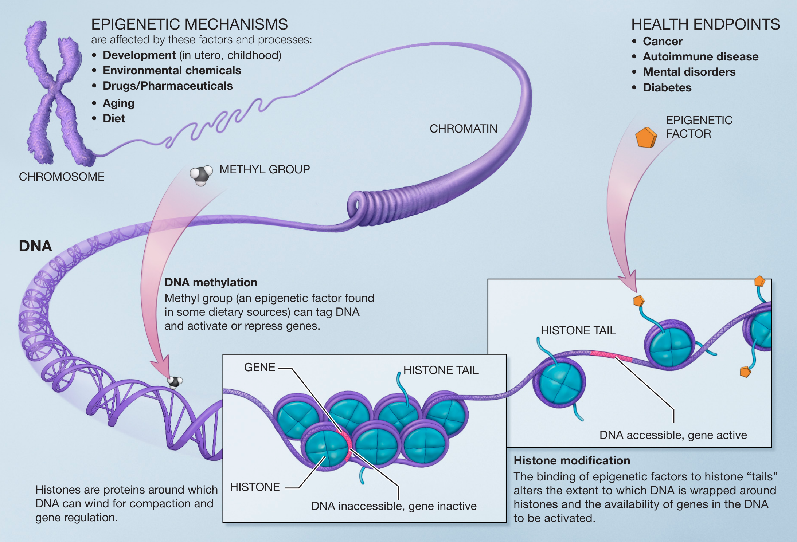
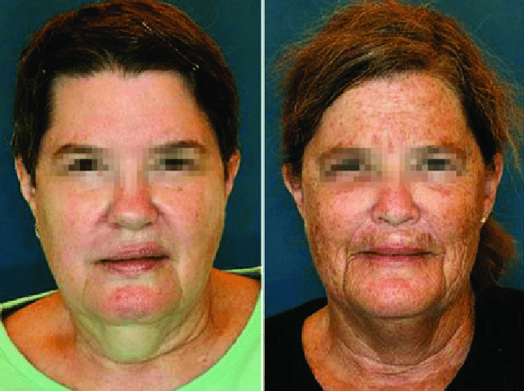

# Ontogenese

In het bovenste deel van het model zien we het biologische aspect " ontogenese" aangeduid in de rode box (zie Figuur \@ref(fig:modelOnto)), waarop we in dit hoofdstuk zullen focussen. 

```{r modelOnto, fig.cap='Biodanza Model en Ontogenese', out.width='50%', fig.asp=.8, fig.align='center', echo=FALSE}
knitr::include_graphics("./figs/biologischeAspectenBiodanzaDeelIII.png")
```


De ontogenese is de ontwikkeling van een organisme vanaf een bevruchte eicel naar het volwassen stadium totdat het uiteindelijk sterft. 

Onze ontogenese begint met het genetisch potentieel dat we erven van onze ouders via hun eicel en zaadcel. De bevruchte eicel begint zich dan te delen en op een bepaald moment beginnen de cellen zich te differentiëren in verschillende weefsels.
En dat terwijl al onze cellen^[behalve onze voortplantingscellen] hetzelfde genetisch materiaal hebben! 

Onze omgeving en hoe we met onze omgeving omgaan is een andere heel belangrijke factor in onze ontwikkeling. Ons fenotype, onze waarneembare eigenschappen en kenmerken, komen voort uit de complexe wisselwerking tussen onze genomische samenstelling, ons genotype, en omgevingsfactoren.

De hoofdvraag bij ontogenese is hoe cellen van verschillende weefsels van hetzelfde organisme die dus allen dezelfde genetische code hebben, morfologisch zo verschillend kunnen zijn, en, hoe de omgeving en veranderingen in onze omgeving ons fenotype kunnen beïnvloeden. 

Dit komt door epigenetica! En epigenetica is de ontbrekende schakel die Rolando Toro nodig had om uit te leggen hoe Biodanza een verrijkte omgeving vormt die organische en cellulaire vernieuwing, affectieve heropvoeding en het opnieuw leren van de oorspronkelijke functies van het leven induceert.

## Epigenetica

Epigenetica is de studie van hoe ontwikkeling, gedrag en omgeving veranderingen kunnen veroorzaken die invloed hebben op de manier waarop we onze genen gebruiken. Hoewel epigenetische veranderingen, integenstelling tot mutaties, ons DNA-volgorde niet veranderen, hebben ze wel een grote invloed op hoe ons lichaam onze genen kan lezen of net niet kan lezen.

Epi betekent "bovenop" en genetica "onze genen". En dat is letterlijk wat het betekent: een set instructies die bovenop onze genen ligt.  Epigenetica werkt door middel van epigenetische merkers, kleine moleculen die interageren met ons DNA. Deze merkers kunnen genen afleesbaar of niet-afleesbaar maken voor de cel.

Epigenetica heeft een grote invloed op onze biologie. Onze hersen- en spiercellen hebben bijvoorbeeld hetzelfde DNA, maar zijn totaal verschillend van vorm en functie (zie Figuur \@ref(fig:brainMuscle)). Dit komt omdat ze een heel andere set genen gebruiken. Het verschil in de genen die ze tot expressie brengen, wordt voor een groot deel bepaald door verschillen in hun epigenoom, d.w.z. de verzameling epigenetische merkers over hun hele genoom^[alle genetische informatie of DNA van een cel of organisme]. Opmerkelijk genoeg worden deze epigenetische merkers ook gekopieerd wanneer een cel zich deelt, dus hersencellen blijven hersencellen en spiercellen blijven spiercellen na celdeling.  

```{r brainMuscle, fig.cap='Hersen- (links) and spiercellen (rechts) (Wikipedia: BrainsRusDC, links and Nephron, rechts).', out.width='90%', fig.asp=.8, fig.align='center', echo=FALSE ,fig.show='hold'}
knitr::include_graphics(c("./figs/brainMuscleCells.png"))
```

De belangrijkste epigenetische veranderingen vinden plaats tijdens de embryonale ontwikkeling. In een bevruchte eicel zijn al onze genen min of meer toehankelijk. Maar naarmate het embryo zich ontwikkelt, differentiëren cellen zich in hersencellen, spiercellen, zenuwcellen, levercellen enz. Deze differentiatie gebeurt door het toevoegen of verwijderen van epigenetische merkers, en dat is het gevolg van verschillen in de hormoonconcentratie over het hele embryo en door de signalen die een cel ontvangt van zijn buurcellen.

Dit brengt ons bij een heel belangrijk punt van epigenetica voor Biodanza: epigenetica wordt grotendeels beïnvloed door de omgeving. Niet alleen de naburige cellen hebben invloed op het ontwikkelende embryo, maar ook ondermeer het voedsel, rookgedrag en stressniveau van de moeder. Dat wordt via haar bloedbaan doorgegeven aan de ontwikkelende foetus en zal een epigenetische invloed hebben die zal bepalen hoe de foetus zijn genen zal gebruiken in zijn volwassen leven. Nog interessanter voor Biodanza is dat het epigenetische proces na de geboorte blijft verdergaan. Dat is in het bijzonder zo voor onze hersenen die ons hele leven lang blijven ontwikkelen, en ook hier is de interactie met onze omgeving van vitaal belang.

Bij ratten is bijvoorbeeld aangetoond dat het verzorgen en zogen door de moeder een grote invloed heeft op de zogenaamde "hypothalamus-hypofyse-bijnier" (HPA) stress- en verdedigings respons van volwassen ratten [@Meaney2004]. Volwassen ratten, die koesterende moeders hadden als pup, gedragen zich minder angstig onder stressomstandigheden en vertonen een actiever exploratiegedrag wanneer ze in een nieuwe omgeving worden geplaatst. Dit komt door het epigenoom van de glucocorticoïde receptor (GR) in hun hippocampus dat wordt beïnvloed door het moeder-pup contact in de eerste week van hun leven. Het epigenoom van de ratten, die werden gekoesterd door hun moeder als pup, zorgt voor hogere expressieniveaus van de GR in hun volwassen leven, waarvan is geweten dat het hun HPA-stressrespons tempert [@Meaney2004;  @Meaney2005]. Deze bevindingen werden ook vertaald naar mensen: vergelijkbare effecten op het GR epigenoom werden waargenomen in post-mortem menselijk hersenweefsel tussen mensen met een normale jeugd en mensen met een geschiedenis van kindermishandeling [@Meaney2009]. De auteurs toonden ook bij ratten aan dat deze epigenetische merkers, als gevolg van gedragsprogrammering als pup, omkeerbaar waren in het volwassen brein [@Meaney2005]. 

Belangrijk voor Biodanza is het bewijs voor de cruciale rol van epigenetica voor leerprocessen en voor de manier waarop de expressie van onze genen door onze levensstijl wordt beïnvloed. 
Studies bij knaagdieren hebben bijvoorbeeld het belang aangetoond van een verrijkte omgeving, met verhoogde niveaus van multisensorische stimulatie, fysieke activiteit en sociale interacties, op hun neuroplasticiteit^[neuroplasticiteit is het vermogen van het zenuwstelsel om zijn activiteit te veranderen in reactie op intrinsieke of extrinsieke stimuli door het reorganiseren van zijn structuur, functies of verbindingen na verwondingen] [@baroncelli2010]. Er is ook aangetoond bij muizen dat een verrijkte omgeving de oxidatieve stress en ontsteking in hun hippocampus vermindert [@grinan2016] en een jong epigenetisch landschap weet te behouden in de verouderde hippocampus^[De hippocampus is een belangrijk onderdeel van de hersenen. Het speelt een belangrijke rol bij leren en geheugenconsolidatie] [@zocher2021]. 
In tweelingstudies bij mensen is een verband gevonden tussen lichaamsbeweging en epigenetische merkers die verband houden met een verminderde ontwikkeling van het metabool syndroom [@Duncan2022]. Deze epigenetische veranderingen werden in verband gebracht met genen waarvan bekend is dat ze betrokken zijn bij lichaamsbeweging en obesitas. @BlackburnEpel2017 bespreken ook studies waarin werd aangetoond dat mind-body technieken zoals meditatie, qigong en yoga stressverlagend werken, positieve effecten hebben op ons welzijn, ontstekingen kunnen voorkomen en celverjonging kunnen induceren door belangrijke genen voor cel- en weefselherstel en regeneratie (opnieuw) te activeren. Deze effecten zijn waargenomen in goed opgezette experimenten en komen overeen met de heilzame effecten die Rolando Toro ook voor ogen had met zijn Systeem van Biodanza. 

In dit hoofdstuk duiken we dieper in het fascinerende domein van de epigenetica. We introduceren epigenetische merkers en illustreren de rol van epigenetica in embryonale ontwikkeling, leren, veroudering en stress.

## Epigeneticsche Merkers

Epigenetische merkers zijn kleine moleculen die een directe interactie aangaan met het DNA of met histonen (zie Figuur \@ref(fig:epigenetics)). Histonen zijn specifieke eiwitten die fungeren als spoelen die de lange DNA-molecule in een compactere/condenseerdere vorm wikkelen.  Ze kunnen dus genen toegankelijk of ontoegankelijk maken voor RNA-transcriptie en dus uiteindelijk voor de productie van eiwitten. Twee veel voorkomende types zijn 

- DNA-methylatie: de direct binding van een methylgroep aan DNA^[Een methylgroep (-CH$_3$) bestaat uit één koolstof en drie waterstofatomen].
- Histonacetylatie: het binden van een acetylgroep aan histon-eiwitten^[Een acetylgroep (-CO-CH$_3$) bestaat uit twee koolstof-, één zuurstof- en drie waterstofatomen].

```{r epigenetics, fig.cap='Principes van epigenetica. Kleine moleculen, epigenetische merkers, interageren met het DNA en histonen. Ze kunnen ervoor zorgen dat een gen toegankelijk of ontoegankelijk wordt voor RNA-transcriptie (Bron: NIH, Wikipedia)', out.width='100%', fig.asp=.8, fig.align='center', echo=FALSE}

```
<!-- Note, that binding a molecule on a protein after translation is also referred to as post translational modification (PTM). --> 

Beide types kunnen de activiteit van genen beïnvloeden. Aan de ene kant onderdrukt DNA-methylatie actief de expressie van een specifiek gen, terwijl DNA-de-methylatie de genexpressie versterkt. Aan de andere kant maakt histonacetylatie de structuur van een DNA-regio meer open en dus makkelijker toegankelijk voor transcriptie van de genen in die regio, terwijl de-acetylatie het tegenovergestelde effect heeft. 

## Epigenetica tijdens de Embryonale Ontwikkeling

Epigenetica speelt een belangrijke rol in de embryonale ontwikkeling (zie figuur \@ref(fig:epiEmbryo)). 

(ref:epiEmbryoLab) Epigenetica van CpG-eilanden, gebieden die veel methylgroepen kunnen binden, tijdens de embryonale genese. Alle CpG-eilanden van een zaadcel zijn bijna volledig gemethyleerd. Die van een eicel zijn voor ongeveer voor 50% gemethyleerd. Bij bevruchting daalt de methylatiegraad en worden bijna alle genen toegankelijk voor de ongedifferentieerde blastula. Naarmate cellen zich differentiëren en specifieke functies in weefsels krijgen, neemt de methylatiegraad weer toe (Bron: Mariuswalter, Wikipedia)

```{r epiEmbryo, fig.cap='(ref:epiEmbryoLab)', out.width='100%', fig.asp=.8, fig.align='center', echo=FALSE}
knitr::include_graphics("./figs/DNA_methylation_reprogramming.png")
```

CpG-eilanden zijn regio's in ons DNA die sterk gemethyleerd kunnen zijn. Ze hebben een belangrijke rol in genregulatie. Ongeveer 70% van onze genen hebben CpG-eilanden in hun promotorgebieden^[Een promotor is een DNA-sequentie waaraan eiwitten zich binden om transcriptie van het gen stroomafwaarts van de promotor te starten]. Methylatie van de promotorregio is meestal geassocieerd met een vermindering van de genexpressie. In Figuur \@ref(fig:epiEmbryo) zien we dat de CpG-eilanden van een zaadcel bijna volledig gemethyleerd zijn, wat aangeeft dat veel genen waarschijnlijk niet kunnen worden afgelezen. De CpG-eilanden van een eicel zijn voor ongeveer voor 50% gemethyleerd. Na de bevruchting daalt de methylatiegraad in de blastocyste^[een vroeg stadium van de embryonale ontwikkeling, ongeveer vijf dagen na de bevruchting]. Dit is nodig om de cellen weer de eigenschap te geven dat ze zich kunnen delen en differentiëren naar alle celtypen van de ontwikkelende embryo. Wanneer de differentiatie van de cellen begint en ze zich ontwikkelen tot weefsels, neemt de methylatiegraad weer toe, zodat de cellen maar tot specifieke genen toegang hebben en meer specifieke functies krijgen. Merk op dat de methylatiestatus ook wordt doorgegeven bij celdeling, wat leidt tot invariantie van gedifferentieerde cellen: inderdaad, een spiercel blijft een spiercel na celdeling en een hersencel een hersencel, etc.   

## Epigenetica en Leren

Deze sectie is grotendeels gebaseerd op het overzichtsartikel van @Creighton2020 "Epigenetic Mechanisms of Learning and Memory: Implications for Ageing".

In de afgelopen decennium is aangetoond dat epigenetica een belangrijke rol speelt bij de ontwikkeling van de hersenen en bij het leren. 

Onderzoek met proefdieren heeft aangetoond dat de verstoring en remming van genexpressie en de vertaling naar eiwitten in de hersenen kort na een leergebeurtenis een enorme invloed heeft op langetermijnherinneringen ($\geq24$ uur), maar niet op kortetermijnherinneringen. Deze manipulaties hadden vooral een invloed in de eerste uren na de leergebeurtenis. Dit suggereert dat de eerste geheugenconsolidatie binnen de 6 uur plaatsvindt.  

Leren gebeurt meestal in golven. Genen die kort na het leren worden geactiveerd, keren binnen 24 uur terug naar hun basis expressieniveau. Dat is het tijdstip waarop een tweede golf van genexpressie wordt geactiveerd. 
In de tweede golf zijn genen betrokken die coderen voor epigenetische regulatoren. 
Het is dus bekend dat de eerste golf binnen 6 uur na het leren transcriptiefactoren opreguleert die belangrijk zijn voor het initiëren van de tweede transcriptiegolf, die nodig is om langdurige herinneringen te consolideren. 

<!--Understanding memory consolidation gets even more complex due to the reorganization of neural networks associated with recent memory storage and later memory phases ($>7$ days).-->

### DNA-methylatie en Geheugen

In een groot aantal onderzoeken is aangetoond dat DNA-methylatie een belangrijke rol speelt in verschillende stadia van geheugenvorming. 

Enerzijds is aangetoond dat DNA methylatie van voorbijgaande aard is, d.w.z. snel wordt geïnduceerd en daarna weer wordt omgekeerd in de eerste uren na het leren. Anderzijds is aangetoond dat stabiele veranderingen in de DNA-methylatie van de cortex tot 4 weken na het leren optreedt en dat het blokkeren van corticale DNA-methylatie het geheugen aantast.
Methylatie speelt dus een rol in verschillende stadia van het proces van geheugenvorming. 

Er is ook aangetoond dat methylatie het geheugen beïnvloedt via verschillende mechanismen, b.v. 

- Regeling van de activiteit van enhancers, dat zijn korte DNA-sequenties die de transcriptie van genen versterken
- Alternatieve splicing, afgelezen RNA van een gen wordt gesplitst waarbij bepaalde coderende stukken (exonen) worden verwijderd, wat resulteert in de productie van verschillende genproducten van hetzelfde gen. Methylatie kan dus beïnvloeden welk eiwit er wordt geproduceerd van een bepaald gen. 
- Expressie van micro RNA's, korte niet-coderende RNA's, die biologisch actief zijn. 

Er is veel literatuur rond de rol van methylatie bij leren: er is aangetoond dat tijdens het leren methylatie voorkomt in de hippocampus, prefrontale cortex en de amygdala van de hersenen (Figuur \@ref(fig:brainRegionsLearning)).

```{r brainRegionsLearning, fig.cap='Hersengebieden betrokken bij geheugenvorming. (Bron: Wikipedia)', out.width='50%', fig.asp=.8, fig.align='center', echo=FALSE}
knitr::include_graphics("./figs/Brain_regions_in_memory_formation.png")
```

### Histonmodificaties en Geheugen

Een andere vorm van epigenetische regulatie gebeurt via de modificatie van histonen, de eiwitten die fungeren als spoelen waar de lange DNA-molecule omheen is gewikkeld. De histonmodificaties beïnvloeden de toegankelijkheid van een DNA-regio. 

Er is aangetoond dat histonmodificaties met epigenetische merkers vooral belangrijk zijn in de beginfase van de geheugenconsolidatie. Ze worden snel gemodificeerd waarna ze terugkeren naar hun basisniveau. Deze modificaties veroorzaken "het afwikkelen of oprollen van het DNA van of rond de histonen" waardoor bepaalde genen toegankelijk of ontoegankelijk worden voor expressie. 

Epigenetische histon-merkers lijken de transcriptionele gevoeligheid voor externe prikkels te reguleren. Er is bijvoorbeeld aangetoond dat histonacetyleratie, die het DNA toegankelijker maakt, de expressie verhoogt van genen die door leren worden geïnduceerd. En histonacetylatie blijkt vooral belangrijk te zijn voor de regulatie van de geheugensterkte. 

Recent onderzoek heeft dus het enorme belang aangetoond van epigenetica voor de ontwikkeling van de hersenen en het leren. 
Het gebied van neuro-epigenetica staat nog in de kinderschoenen en er blijven momenteel nog vele vragen onbeantwoord. 

## Epigenetica en Veroudering  {#epigeneticaVeroudering}

Epigenetica wordt ook sterk aangestuurd door ecofactoren. Dat wordt goed geïllustreerd bij een eeneiige tweeling. Beide personen van de tweeling hebben bijna exact hetzelfde genoom^[Een eeneiige tweeling heeft bijna exact hetzelfde genoom, alleen hele kleine verschillen diez zijn opgebouwd in de baarmoeder]. Hoe ouder ze worden hoe makkelijker het wordt om ze uit elkaar te houden. Dat komt door de epigenetische veranderingen die worden veroorzaakt door de verschillende omgevingen waaraan ze zijn blootgesteld. Die hebben veranderd hoe ze hun genen gebruiken. Een goed voorbeeld hiervan is het verschil in huidveroudering tussen tweelingen die op een andere manier aan UV-straling zijn blootgesteld (Figuur \@ref(fig:epiUV)). 

(ref:epiUVlab) Het verschil in huidveroudering tussen broers of zussen van een eeneiige tweeling wordt grotendeels veroorzaakt door epigenetische veranderingen als gevolg van een verschil in blootstelling aan UV-straling [@Schwab2017]

```{r epiUV, fig.cap='(ref:epiUVlab)', out.width='50%', fig.asp=.8, fig.align='center', echo=FALSE}
#knitr::include_graphics("https://www.researchgate.net/profile/Tara-Hogenson/publication/320386487/figure/fig1/AS:783847914471429@1563895314907/dentical-twins-with-phenotypic-discordance-due-to-environmental-exposure-Although-MZ.png")

```

Een ander tweelingenonderzoek toonde een verband aan tussen lichaamsbeweging en epigenetische merkers die geassocieerd zijn met een verminderde ontwikkeling van het metabool syndroom [@Duncan2022]. Door eeneiige tweelingen te bestuderen waarvan de ene persoon fysiek actiever was dan de andere, minimaliseerden de onderzoekers de genetische verschillen tussen actieve en inactieve deelnemers in het onderzoek. Door deze opzet konden ze genetische regio's ontdekken die verschillend gemethyleerd waren tussen actieve en inactieve deelnemers, terwijl hun genetische achtergrond gelijk bleef. De gevonden veranderingen in methylatie zijn geassocieerd met genen waarvan bekend is dat ze betrokken zijn bij fysieke activiteit en obesitas. 


Veroudering en een lang leven worden beïnvloed door genetische, epigenetische en omgevingsfactoren tijdens de ontwikkeling, groei, volwassenheid en oudere leeftijdsstadia.
Het is aangetoond dat de genetische component (erfelijkheid) slechts een matige rol speelt bij veroudering en lang leven, dus epigenetica lijkt een belangrijke bijdrage te leveren [@Adwan2018]. Er is inderdaad aangetoond dat veel epigenetische merkers en in het bijzonder DNA-methylatiesites opmerkelijke goeie voorspellers zijn van chronologische leeftijd. 
Veroudering blijkt gepaard te gaan met ingrijpende veranderingen in het epigenetische landschap, die leiden tot veranderingen in genexpressie en genoomarchitectuur. 

Er is aangetoond dat epigenetica en telomeerlengte een belangrijke rol spelen bij veroudering. 

Telomeren zijn regio's van repetitieve nucleotidesequenties die geassocieerd worden met gespecialiseerde eiwitten aan de uiteinden van onze chromosomen, zie Figuur \@ref(fig:telomeres). Bij elke celdeling worden de telomeren korter. Dat korter worden van telomeren wordt in verband gebracht met veroudering van cellen, weefsels en organen. 

```{r telomeres, fig.cap='Telomeren zijn repititieve nucleotidesequenties aan het einde van een chromosoom. Telkens wanneer een cel zich deelt, worden de telomeren aan het uiteinde van het chromosoom kleiner. De gemiddelde cel deelt zich tussen de 50 en 70 keer voordat de cel sterft (Bron: Wikipedia).', out.width='80%', fig.asp=.8, fig.align='center', echo=FALSE}

```


@BlackburnEpel2017 gebruiken de plastic uiteinden van schoenveters als analogie voor telomeren. Als deze uiteinden korter worden, kan de schoenveter gaan rafelen. Dat is net zo bij de telomeren, als die te kort worden, loopt de integriteit van het chromosoom gevaar bij de volgende celdeling. Daarom gaat een cel met te korte telomeren over in senescentie: ze stopt met celdeling, wat uiteindelijk tot celdood zal leiden. 

Maar door een enzymcomplex dat telomerase heet, kunnen de telomeren worden verlengd. In de schoenveter analogie is telomerase dus de lijm waarmee we de plastic kapjes van een schoenveter kunnen herstellen. 

Er zijn steeds meer aanwijzingen dat telomeren een rol spelen in ouderdomsprocessen. Mutaties in telomerase en telomeergenen die een verhoogde verkorting van telomeren veroorzaken, komen voor bij patiënten met leeftijdsgerelateerde ziekten, zoals degeneratief orgaanfalen en het vatbaarder zijn voor kanker. Bovendien zijn er oorzakelijke verbanden tussen telomeerverlies, cellulaire senescentie (toenemende celdood) en veroudering vastgesteld bij genetisch gemodificeerde diermodellen [@Adwan2018].

Epigenetica blijkt ook een belangrijke rol te spelen bij telomeeronderhoud [@Adwan2018]. 
Meerdere studies hebben aangetoond dat telomere en subtelomere regio's histonmodificaties bevatten en dat het subtelomere DNA methyleratie kan ondergaan.
Hierbij induceert de epigenetische modificatie geen veranderingen in de expressie van genen, maar beïnvloedt ze wel de telomeerlengte of telomeerstructuur.
Bovendien is aangetoond dat genen die betrokken zijn bij de productie van telomerase ook d.m.v. methylatie worden gereguleerd.

## Epigenetica en Verrijkte Omgeving

De omvangrijke wetenschappelijke literatuur over de invloed van verrijkte omgevingen op neuroplasticiteit en hersenveroudering bij knaagdieren is ook heel interessant om de werking van Biodanza beter te begrijpen. 

Uit de wetenschappelijke literatuur wordt de achteruitgang van hersenfuncties tijdens het ouder worden in verband gebracht met epigenetische veranderingen. De hippocampus speelt bijvoorbeeld een belangrijke rol bij de consolidatie van informatie uit het kortetermijngeheugen naar het langetermijngeheugen. Muizenstudies hebben bijvoorbeeld aangetoond dat een verrijkte omgeving een belangrijke invloed heeft op het epigenetische landschap van de hippocampus (zoals b.v. @zocher2021, en @grinan2016). 

De verrijkte omgeving voor de knaagdieren bestond uit het gebruik van grote kooien die ze in grote groepen kunnen exploreren. De kooien zijn uitgerust met speeltjes die regelmatig worden verplaatst. De verrijkte omgeving vergroot dus fysieke, cognitieve, zintuiglijke en sociale stimulatie in vergelijking met conventionele labocondities. 

@zocher2021 toonde aan dat de verrijkte omgeving veroudering-geïnduceerde CpG-hypomethylering tegenging op doelsites van het methyl-CpG-bindende eiwit Mecp2, dat cruciaal is voor de neurale functie. Van de genen die in de studie werden gevonden, is in de literatuur bekend dat ze een rol spelen bij neurale plasticiteit, neurale celcommunicatie en neurogenese^[neurogenese: proces waarbij nieuwe neuronen worden gevormd] in de hippocampus van volwassen dieren. Bovendien is geweten dat de ontregeling van deze genen verband houdt met leeftijdsgerelateerde cognitieve achteruitgang in het menselijk brein. 

Het onderzoek van @grinan2016 bij SAMP8 muizen, een muizenstam die wordt gekenmerkt door leeftijdsgerelateerde achteruitgang die invloed heeft op leren en geheugen, toonde aan dat een verrijkte omgeving hun cognitieve achteruitgang verminderde. De verrijkte omgeving verminderde de  oxidatieve stress en ontsteking in de hippocampus bij SAMP8 muizen en dit eveneens door het induceren van epigenetische veranderingen. 

Deze onderzoeken benadrukten onder andere de gunstige effecten van een verrijkte omgeving op de plasticiteit van de hippocampus via DNA-methylering en toonden aan dat specifieke aspecten van hersenveroudering kunnen worden tegengegaan door lifestyle interventies. 

## Epigenetica en Stress

Epigenetica blijkt ook een belangrijk mechanisme te zijn waardoor stressoren kunnen interageren met het genoom. Dit leidt tot stabiele veranderingen in de DNA-structuur, genexpressie en gedrag (zie b.v. @Park2019).

Interessant is dat stress en depressie voornamelijk zijn geassocieerd met epigenetische veranderingen in genen die betrokken zijn bij het mediëren van veerkracht, kwetsbaarheid voor stress en genen die gerelateerd zijn met de stressrespons (b.v. @Park2019). 

In hun boek "the telomere effect" geven @BlackburnEpel2017 een overzicht van hun studies naar de impact van stress op telomeerlengte en telomeraseactiviteit. Ze geven tot de verbeeldingsprekende voorbeelden en onderzoeksresultaten die onderbouwen dat verouderingseffecten sterk worden beïnvloed door stress tijdens de kindertijd en door langdurige stress op latere leeftijd. En dat via mediatie van de telomeraseactiviteit en telomeerlengte, waarvan we in Sectie \@ref(epigeneticaVeroudering) hebben geargumenteerd dat ze grotendeels onder controle staan van de epigenetica. 

@BlackburnEpel2017 bespreken ook studies waarin werd aangetoond dat mind-body technieken zoals meditatie, qigong en yoga stressverlagend werken, positieve effecten hebben op ons welzijn, ontstekingen kunnen voorkomen en celverjonging kunnen induceren. Dat ondermeer door het gen dat codeert voor teleomerase (opnieuw) te activeren. Deze effecten werden waargenomen in goed ontworpen experimenten en zijn in lijn met de heilzame effecten die Rolando Toro ook voor ogen had met zijn Systeem van Biodanza. 

## Ontogenese in het Biodanza-Model

Epigenetica is dus de wetenschappelijke verklaring voor ontogenese in Rolando Toro's Systeem van Biodanza. Of om het met een quote van Rolando te zeggen "Es que en la epigénesis
se permite o no la expresión de los genes existentes" [@Montanari2023]. Of, "het is dus door epigenetica dat de expressie van bestaande genen wel of niet mogelijk is". 

Onze ontogenese, of de vorming van ons fenotype, is dus niet onmiddellijk het resultaat van ons genoom, maar van het modulatie mechanisme van ons genoom: de activatie en inhibitie van de expressie van de genen die we hebben geërfd van onze biologische ouders.   

Rolando betoogde verder dat "We hebben veel genen die niet goed zijn (...) Het is de epigenetica, door de verrijkte omgeving, die de expressie blokkeert of toestaat van sommige aspecten van de genetische code (...) Soms blokkeert de omgeving de kwaadaardige genen niet, dan verschijnt de pathologie" [@Montanari2023]. In dat opzicht kan het beoefenen van Biodanza gezien worden als het regelmatig toedienen van prikkels door middel van vivencia die veranderingen en herstel teweegbrengen die nodig zijn om ons biologische systeem weer in balans te brengen van de schade die veroorzaakt is door onze toxische ervaringen en de aanvallen van ziekteverwekkers [@Montanari2023]. 

In dit hoofdstuk hebben we de biologische invalshoek van ontogenese geïntroduceerd waarmee we de biologische aspecten van het Biodanza-Model afsluiten. We hebben ons gefocust op de biologische component van ontogenese. Merk echter op dat het niet onze bedoeling is om ontogenese in het Biodanza-Model te reduceren tot enkel biologische aspecten. De biologische ontwikkeling van een individu vindt namelijk plaats in een groter veld. Er is ook een belangrijke sociale, psychologische en emotionele component bij betrokken omdat een belangrijk deel van het menselijk leven zich afspeelt in het sociaal-symbolische domein. 

Dit grotere en belangrijke kruispunt van de levenswetenschappen, fysiologie, antropologie, sociologie, psychologie, kunst en mystiek valt buiten het bestek van deze monografie. Het is in dit grotere veld waarin Rolando zich bewoog toen hij zijn systeem van Biodanza ontwikkelde. 