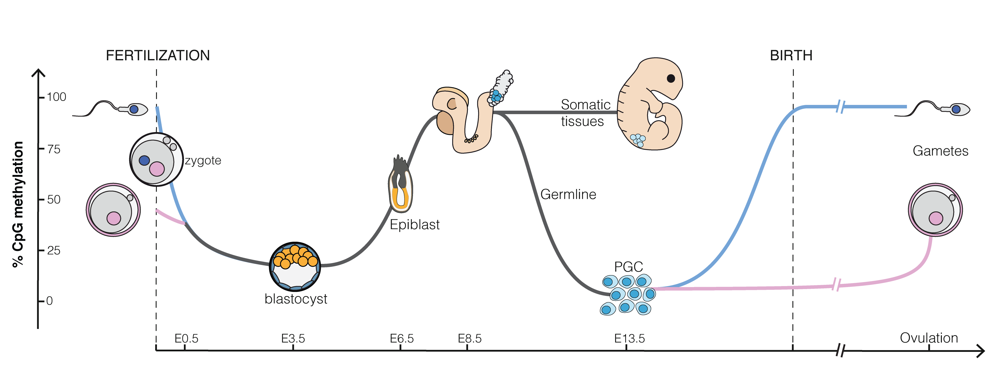

# Introductie

- Opgroeien
    
    - Muziekaal nest
    - Nieuwsgierig 
    - Passie voor wetenschap

- Samen met Fien 

- Mijn Biodanza-reis begon in 2018
    - Fien 
    - Ann
    
- 2020 Kracht van Biodanza
- Opleiding

## Weekend I 


- Vertikale as, het skelet van het model: Mijn passie en professionele pad van afgelopen 30 jaar  
- Methode van Biodanza: het vlees van het model 

## Weekend II: Biocentrisch principe en vitaal onbewuste

In dat weekend leerde ik dat Rolando Toro Biodanza ontwikkelde omdat:  
    
- Westerse mens niet meer verbonden met oorsprong en kosmos, 
- Destructieve culturele vormen 
        
Cartesiaanse kijk

- Gefragmenteerd beeld op het leven 
- scheiding van 

    - lichaam en geest, 
    - mens en natuur, 
    - levende materie en niet-levende materie
    
- ontgekoppelde ons van de kosmische matrix; 
- Deelde onze samenleving op 
- leidde tot de roofbouw 

Rolando plaatste daar zijn Biocentrische Principe: 

- Universum is een levend hologram 
- De matrix van het leven 
- Een zelforganiserende structuur 
- Volgens Rolando is leven de essentiële voorwaarde voor het ontstaan van het universum
- Uitnodiging om onze relatie als mens met kosmos radicaal te herdenken. 
- Vanuit dit gezichtspunt is het leven zelf intrinsiek sacraal
- Zet alle leven, het hele universum, in het hart van onze wereldbeeld

## Wat deed dat met mij? 

- Voelde onmiddellijk belang van biocentrisme "an sich"
<!-- , dat vertrekt vanuit de diepe verwondering voor het leven en het centraal zet in onze wereldbeeld, de sleutel was voor Rolando's systeem van Biodanza. 
--> 

- Axioma kwam mij nogal radicaal over

```Leven is de essentiële voorwaarde voor het ontstaan van het universum``` 

- Triggerde me om zijn opvattingen over het leven te proberen te begrijpen


Ik kwam er al snel achter dat 

- Rolando's opvattingen diep geworteld zijn in het werk van vooraanstaande wetenschappers 

- Christian de Duve en zijn citaten "Life is a cosmic imperative" en "Life is an obligatory manifestation of matter, written into the fabric of the universe", 
- Ilya Prigogine’s "dissipatieve structuren", "dissipatieve zones" en "attractors", en de 
- Maturana en Varella\s concepten "autopoesis" en "autopoëtische eenheden" 

Ondanks mijn sterke wetenschappelijke vorming 

- Nieuwe Concepten die ik niet kende 
- Die ik niet kon begrijpen zonder het werk van de oorspronkelijke auteurs

## Mijn queeste 

Zoals Bohm zo mooi formuleert: 

- Wetenschappelijke theorieën zijn geen "ware kennis" die overeenkomen met "de realiteit zoals die is", 
- maar eerder steeds veranderende inzichten 
- die vorm geven aan hoe wij de wereld zien en ervaren. 

Dit weerspiegelt mijn zoektocht in deze monografie: 

- Wat is het leven volgens Rolando
- Wat was Rolando's visie op de biologische aspecten, die hij inbedde in zijn Biodanza Model.  

# Wat is Leven? 

## Rolando Toro’s Kijk op Leven en zijn Biocentrische Principe

### Universum als Hologram


- Bohm's voorbeeld van kijken sterren 
- Is ook zo voor alle andere golven

### Universum als Levend Hologram

<div><div style="position:relative; padding-top: 56.25%">
<iframe src="figs/lifeCycleSunflowerTimeLapse.mp4" frameborder="0" allowfullscreen
      style="position:absolute;top:0;left:0;width:100%;height:100%;"></iframe>
</div></div>

### Universum als Zelforganiserende Structuur

Big Bang: Groot Katabasis Event / Vernietiging van iets 

$\rightarrow$ met kiem van nieuw leven: ons universum

- jong universum vrij homogeen: veel energie en 
- Creativiteit NA initiële flits van het bestaan
- De anabasis of de opbouw van structuur: elementen, sterren, planeten etc. pas daarna 

Hoe kan dat plaatsvinden? 

- Entropie is fysische analogon van katabasis
- Anabasis
- Katabasis en Anabasis gaan dikwijls hand en hand.

Bernardcellen: een voorbeeld van spontane opbouw van stuctuur

    - Energie
    - Chaos van moleculen
    - Zwaartekrachtveld 
    
<div><div style="position:relative; padding-top: 56.25%">
<iframe src="figs/BernardCellenIk.mp4" frameborder="0" allowfullscreen
      style="position:absolute;top:0;left:0;width:100%;height:100%;"></iframe>
</div></div>

## Prigogine: Thermodynamische Visie op Leven

- Ilia Prigogine ontwikkelde de theorie voor processen waarbij "Orde uit Chaos " kan ontstaan. 

Hij noemt dat dissipatieve structuren: 
- Uit een chaos van moleculen wordt structuur opgebouwd
- Terwijl geconcentreerde energie wordt "gedissipeerd" of omgezet in minder geconcentreerde energie

- Net zoals bij de Bernard cellen is dat ook zo voor veel chemie 

- En biologisch leven is grotendeels uit biochemie is opgebouwd.

- De biologische structuren zijn dus ontstaan uit dezelfde principes als de andere structuren in het universum 


vb 

- Zon is een energiebron die geconcentreerde energie onder de vorm van fotonen uitstraalt.

- Cyanobacteria en planten:

    - organiseren structuur uit de chaos van moleculen op aarde 
    - dissiperen energie uit licht en UV stralen naar warmte b.v. met hun bladgroen

- Dieren, bacteriën en schimmels: 

    - secundaire dissipatieve structuren 
    - voeden met de geconcentreerde chemische energie uit suiker, zetmeel, eiwitten en vetten van andere levende organismen
    - Dissiperen opnieuw energie in de vorm van warmte door hun celademhaling.

- Warmte van biologische leven afgevoerd naar water en lucht 

    - tertiaire dissipatieve processen 
    - watercyclus, 
    - wind- en zeestromingen, …

- Uiteindelijk wordt warmte naar de ruimte uitgestraald.

- Temperatuur van aarde ongeveer constant: evenveel energie naar ruimte uitgestraald in vorm van warmte als wat binnenkomt uit geconcentreerde zonnestralen

- bijna geen materie uitgewisseld tussen aarde en ruimte $\rightarrow materie wordt gerecycleerd $\rightarrow$ leven inherent cyclisch

- Biodanza erkent het belang van verbinding en resonantie met onze cyclische oorsprong! 

$\rightarrow activeert vernieuwingsprocessen!


## de Duve: Biochemische Visie op Leven 

- Leven is één
- Leven is chemie
- Leven is informatie 

### Leven is één

Alle biologische leven 

- is opgebouwd uit cellen

```{r greenAlgae, fig.cap='Cyanobacteriën, eencellige organismen die aan fotosynthese doen. Ze speelden een sleutelrol in de ontwikkeling van het leven en veranderden de aarde radicaal door zuurstof in onze atmosfeer te brengen (Bron: Chisholm Lab, Wikipedia)', out.width='30%', fig.asp=.8, fig.align='center', echo=FALSE}
knitr::include_graphics("./figs/Prochlorococcus_marinus.jpg")
```


- is geëvolueerd zijn uit dezelfde soort, LUCA, onze laatste universele gemeenschappelijke voorouder

```{r treeOfLife, fig.cap='De levensboom is één van de belangrijkste organisatieprincipes in de biologie. Het toont de evolutionaire relaties tussen verschillende organismen en ook dat alle levende wezens uiteindelijk terug te voeren zijn op de laatste universele gemeenschappelijke voorouder (LUCA), die zich aan de wortel van de boom bevindt (Bron: Wikipedia)', out.width='80%', fig.asp=.8, fig.align='center', echo=FALSE}
knitr::include_graphics("./figs/Phylogenetic_tree.svg")
```

- gebruikt dezelfde molecule, ATP, voor het opslaan, omzetten en gebruiken van energie

- is opgebouwd uit dezelfde biologische bouwstenen: 

    - lipiden, 
    - suikers, 
    - eiwitten en 
    - nucleïnezuren: DNA en RNA voor het opslaan en gebruik van ons erfelijk materiaal. 

<!--
Eiwitten:
    
    - Werkpaarden van de cel 
    - Lange keten van aminozuren (AZ)
    - Er bestaan honderden AZ 
    - Leven gebruikt er 20 
    - AZ kunnen in alle mogelijke combinaties voorkomen 
--> 
    
DNA: 
- Vier verschillende basen
    
        - A (Adenine), 
        - G (Guanine), 
        - C (cytosine), 
        - T (thymine) $\rightarrow$ 
- vierletterig alfabet van het leven 
- Kunnen in alle mogelijke combinaties 
    
<!--
#### Eiwitten

```{r aminoAcids, fig.cap='(ref:aminoAcidsCap)', out.width='50%', fig.asp=.8, fig.align='center', echo=FALSE}
#knitr::include_graphics("https://thebiologynotes.com/wp-content/uploads/2020/12/Amino-acids-and-Proteins.jpeg")
knitr::include_graphics("./figs/Amino-acids-and-Proteins.jpeg")
```

- Honderden aminozuren in het universum
- Het biologische leven gebruikt er 20

#### DNA

```{r DNA, fig.cap='DNA bestaat uit vier basen adenine (A), cytosine (C), guanine (G) of thymine (T) die de dragers van informatie zijn.  (Bron: Wikipedia)', out.width='50%', fig.align='center', echo=FALSE}
knitr::include_graphics("./figs/DNA_Nucleotides.jpeg")
```
-->

### Leven is Chemie

```{r chemicalReactionsCell, fig.cap='Netwerk van de belangrijkste reacties in een levende cel (Bron: Dr. Gerhard Michal, Roche)', out.width='100%', fig.asp=.8, fig.align='center', echo=FALSE}
knitr::include_graphics("./figs/roche_pathways.jpg")
```

- Concentratie van producten in cel vrij laag
- Reacties zouden nooit door kunnen gaan
- Eiwitten initiëren, faciliteren en versnelling reacties $10^6$-$10^{11}$.
- En zorgen ervoor dat de uitkomst van de reactie altijd hetzelfde is.

</br>  
<div style="position: relative;width: 100%;height: 0;padding-bottom: 56.25%;">
<iframe
src="https://www.youtube.com/embed/yk14dOOvwMk?start=8&end=48"
frameborder="0"
style=" position:absolute;top: 0;left: 0;width: 100%;height: 100%;"
allow="autoplay; encrypted-media" allowfullscreen data-external="1" start=8></iframe>
</div>
</br>


### Het leven is Informatie

```{r transcriptionTranslation, fig.cap='Van DNA naar eiwitten: een vierlettercode (A,C,T,G): een gen, DNA sequentie, codeert in groepjes van 3 basen voor een sequentie van aminozuren: een eiwit.', out.width='50%', fig.asp=.8, fig.align='center', echo=FALSE}
#knitr::include_graphics("https://aholdencirm.files.wordpress.com/2016/06/transcription_2.jpg")
knitr::include_graphics("./figs/transcription_2.jpeg")
```

Variatie in die vierlettercode zorgt voor een ongelofelijke diversiteit. 

```{r diversity, fig.cap='Van bacteriën tot amfibieën, van plankton tot mieren tot tomaten (bron: India Institute of Ecology and Environment)',out.width='50%', fig.asp=.8, fig.align='center', echo=FALSE}
knitr::include_graphics("./figs/diversityOfLife.jpeg")
```

```{r diversity2, fig.cap='Variatie in DNA',out.width='50%', fig.asp=.8, fig.align='center', echo=FALSE}
knitr::include_graphics("./figs/humanApeBanana1.png")
```

## Varella & Maturana: Systeem Visie op Leven

### Autopoeitische eenheid

 Autopoiesis (Capra & Luisi): 

- "Auto", betekent "zelf" en refereert naar de autonomie van zelforganiserende systemen 
- "poiesis" betekent "makend"

$\rightarrow$ Autopoiesis: "zelf-makend”.

- "Belangrijkste kenmerk van leven is zelfbehoud dankzij het interne netwerk van een chemisch systeem dat zichzelf voortdurend reproduceert binnen zijn eigen grenzen".


```{r greenAlgae2, fig.cap='Een cel is de kleinste autopoeitische eenheid', out.width='30%', fig.asp=.8, fig.align='center', echo=FALSE}
knitr::include_graphics("./figs/Prochlorococcus_marinus.jpg")
```

```{r chemicalReactionsCell2, fig.cap='Netwerk van de belangrijkste reacties in een levende cel (Bron: Dr. Gerhard Michal, Roche)', out.width='100%', fig.asp=.8, fig.align='center', echo=FALSE}
knitr::include_graphics("./figs/roche_pathways.jpg")
```


### Emergente eigenschappen

```{r multiCellular, fig.cap='Multicellulaire organismen en biologische organisatie (Bron: mrssmithsbiology)', out.width='30%', fig.asp=.8, fig.align='center', echo=FALSE}
#knitr::include_graphics("https://mrssmithsbiology.files.wordpress.com/2019/10/picture4.jpg")
knitr::include_graphics("./figs/organisationMulticellular.jpeg")
```

- ons darmmicrobioom: netwerk van miljarden eencellige bacteriën en gisten $\rightarrow$ unieke metabolische functies essentieel voor voedselvertering 

- Ons denken komt bijvoorbeeld voort uit het complexe netwerk van neuronen in onze hersenen.

### Leven als Gestalt

Het leven is de synergie van drie domeinen: 

- Omgeving,
- Cognitie en
- De autopoëtische eenheid

wat Varella de "embodied mind" noemt.


- Levend organisme is een open systeem dat via zijn sensorische arsenaal interageert met zijn omgeving. 
- Het voelt zijn omgeving
- Het voedt zich met zijn omgeving 
- Het bouwt zichzelf op uit zijn omgeving
- Het laat er producten in los in zijn omgeving
- Het verandert zijn omgeving en 
- Actualiseert zichzelf door de interacties met zijn omgeving

Organisme is een logboek van zijn eerdere interacties met zijn omgeving en dat bepaalt zijn toekomstige interacties. 

- Cognitie is dus een natuurlijke eigenschap van zijn evolutie.


###  Ons Sociale Systeem als een Emergente Eigenschap

- Dualiteit van materie en geest niet langer nodig
- Ons denken is een emergente eigenschap van ons netwerk van neuronen

Volgend niveau: groepen van mensen

- Ontstaan van taal
- Ontstaan van sociaal symbolische wereld 
- Heel belangrijk deel van ons leven in sociaal symbolisch domein
- Sociale netwerken volgen zelfde algemene principes als biologische netwerken 


### Gedeelde "Bio-logica" van Cellen tot Sociale Systemen

- Social systeem is een open systeem met sociale feedbacklussen
- Sociaal systeem houdt zichzelf op een stabiele maar dynamische manier in stand

    - nieuwe leden, materialen en ideeën binnen te laten
    - die te transformeren door de interne regels van de organisatie van het systeem

- sociale homeostase

- Nieuwe ideeën kunnen zo krachtig zijn dat ze het sociale systeem omverwerpen of transformeren

De ‘biologische logica’ of het organisatiepatroon van een cel is vergelijkbaar met dat van een hele sociale structuur

- We kunnen leren van alle andere levensvormen
- Wisten primitive volken al: indianen refereren naar alle andere levensvormen als People
- Zonnebloem voorbeeld 

## Rolando Toro's Visie op Leven

Aan einde van monografie:

- Rolando heeft zijn visie opgenomen in zijn model
- Het stond al die tijd gewoon voor mijn neus
- Voor Rolando is Leven:


Dat idee zien we ook terug in oude culturen en wordt Biodanza als metaforen gebruikt: 

- Yin en Yang 
- Shiva (Katabasis) - Bhrama (Anabasis) - Vishnoe (instandhouding/homeostase)


Anabasis / Katabasis we op elke schaal terug in het universum: 

- Van de big bang waaruit daarna het hele universum kwam
- Tot de Bernard cellen...

Varella en Maturana: Leven is gestalt van autopoietische eenheid - cognitie - omgeving

$\updownarrow$

Rolando: Leven zijn twee pulserende krachten die een steeds evoluerende gestalt van omgeving, autopoëtische eenheden en cognitie ontwikkelen. 

- Leven voor Rolando is nog veel alomvattender. 
- Hij beperkt zich niet tot biologische leven waarin autopoëtische eenheden zijn betrokken. 
- Alle structuren in het universum komen voor hem door het leven tot stand. 

- "Het leven is één": één grote kosmische dans

of om het met Rolando’s woorden te zeggen 

"het rijk van het leven omvat veel meer dan de planten, de dieren en de mens. Alles wat bestaat, van neutrino’s tot quasars, van edelsteen tot de meest subtiele gedachte, maakt deel uit van dit wonderbaarlijke levende systeem."

## Waarom belangrijk voor Biodanza 

Biodanza en vivencia 

- laat ons de eenheid van het leven voelen en ervaren 
- spreekt onmiddellijk ons primaire cognitie aan zonder dat ons denken in de weg zit 
- brengt ons in contact met/ en bevrijdt onze instincten 
- instincten die de intelligentie zijn van een soort 
- en diep verankerd zijn in onze biochemie

# Principes van het Kosmische Leven en Genese van het leven


```{r evolutionUniverse, fig.cap='Ontstaan ​​en evolutie van ons heelal (Bron: NASA/WMAP Science Team, Wikipedia)', out.width='100%', fig.asp=.8, fig.align='center', echo=FALSE}
knitr::include_graphics("./figs/originKosmos.jpg")
```

- Big bang: Grote katabasis event
- Daarna Anabasis: 

    - Jong Universum vrij egaal en energierijk 
    - Afkoeling: energie omgezet in massa 
    - Eerste sterren: energie uit omzetting van waterstof (lichtste element) in zwaardere elementen (N, O, P, S, Fe, ...)

Figuren ster - supernova - energie fusie grafiek

- Alles rondom ons en ook wijzelf zijn opgebouwd uit sterrenstof
- We zijn kinderen van de kosmos
- In Biodanza gaan we dat doorvoelen en ons daarmee verbinden

# Fylogenese & Evolutie


- Vond Rolando evolutie heel belangrijk omdat het laat ons zien hoe alle biologische organismen verwant zijn.
- Hoe alle levensvormen volgens dezelfde principes zijn gestructureerd
- Metabolisch geheugen: Alle cellen zijn zonder enige discontinuïteit chemisch verbonden met de eerste cellen. 
- Ons metabolische arsenaal is een weerspiegeling van de omgevingen waaraan ze zijn blootgesteld tijdens hun evolutionaire traject
- Alle biologische levensvormen hebben dezelfde overkoepelende instincten die anders zijn gedifferentieerd. 
- Vb Vecht-vlucht reflex: 
    - Doornen bij roos
    - Elegante loop bij een gazelle met snelheden tot 100 km/u,
    - Op de rem trappen als de auto voor je plotseling stopt
    
- Die instincten diep zijn ingebed in hun biochemie en behoren tot de intelligentie van een soort.

- Voor Rolando gaat evolutie verder dan biologische leven, omvat ook de evolutie van alle structuren in de kosmos

- Belangrijk is om evolutie niet te verwarren met toenemende complexiteit

-  De twee organisatieprincipes: Anabasis en Katabasis zien als een creatief proces 

    - dat leidt tot het genereren van nieuwe structuren; 
    - sommige zijn meer eenvoudig, 
    - terwijl andere complexer zijn; 
    - en ze hebben allemaal hun eigen ritme en unieke kosmische dans. 
    
Dus de essentie van evolutie is de rijkdom en diversiteit die ontstaat.

Uiterst waardevol om te bestuderen wat alle leven gemeen heeft: 

- Onszelf beter kunnen begrijpen 
- Ons (opnieuw) verbonden en verenigd kunnen voelen met het biologische leven en het hele universum.

Met Biodanza gaan we 
- Ons weer met onze instincten verbinden 
- en via de dans gaan we die eenheid doorvoelen en oproepen: 
    - Jezelf
    - De ander
    - Alle leven, de hele kosmos

In het hoofdstuk ga ik daarna dieper in 
- op technische aspecten van evolutie
- de link met de evolutie van de mens
- wat dat betekent voor Biodanza

# Ontogenese


Ontogenese is de ontwikkeling van een bevruchte eicel tot volwassen individu die uiteindelijk sterft. 

- Biologisch domein
- Sociaal-symbolisch domein

Hoe kan Biodanza nu zo een grote impact hebben op ons zijn? $\rightarrow$ epigenetica. 

## Epigenetica

- Epigenetica is de studie van hoe ontwikkeling, gedrag en omgeving veranderingen kunnen veroorzaken die invloed hebben op de manier waarop we onze genen gebruiken.
- Epigenetische veranderingen veranderen onze DNA-volgorde niet
- Maar hebben wel een grote invloed op hoe ons lichaam onze genen kan lezen of net niet kan lezen.

- Epi betekent “bovenop” en genetica “onze genen”. 
- Epigenetica is dus letterlijk: een set instructies die bovenop onze genen ligt. 
- Epigenetica werkt door middel van epigenetische merkers, kleine moleculen die interageren met ons DNA. 
- Deze merkers kunnen genen afleesbaar of niet-afleesbaar maken voor de cel.

- Onze hersen- en spiercellen hebben bijvoorbeeld hetzelfde DNA, maar zijn totaal verschillend van vorm en functie

```{r brainMuscle, fig.cap='Hersen- (links) and spiercellen (rechts) (Wikipedia: BrainsRusDC, links and Nephron, rechts).', out.width='90%', fig.asp=.8, fig.align='center', echo=FALSE ,fig.show='hold'}
knitr::include_graphics(c("./figs/brainMuscleCells.png"))
```

- Een cel die deelt, kopieert alle epigenetische merkers: 
    
        - Delende hersencel $\rightarrow$ 2 hersencellen 
        - Delende spiercel $\rightarrow$ 2 spiercellen

## Embryonale ontwikkeling

```{r epiEmbryo, fig.cap='(ref:epiEmbryoLab)', out.width='100%', fig.asp=.8, fig.align='center', echo=FALSE}

```

- Cel differentiatie door toevoegen of verwijderen van epigenetische merkers
    
    - Door verschil in hormoonconcentratie over het hele embryo 
    - Door de signalen van buurcellen

- Ook door het voedsel, rookgedrag en stressniveau van de moeder

$\rightarrow$ Kan bepalen hoe foetus zijn/haar genen zal gebruiken in zijn volwassen leven   
$\rightarrow$ Effect op primordiale geslachtcellen en dus op toekomstig kinderen van de foetus

## Kernpunten voor Biodanza

- Epigenetica grotendeels beïnvloed door de omgeving. 
- Epigenetica gaat verder na geboorte
- In bijzonder voor onze hersenen

### Experimenteel bij ratten

- Babyratjes die worden gelikt en gekoesterd door moederrat  

    - ander gedrag als volwassen rat 
    - door epigenetische veranderingen in hun hersenen gedurende die eerste week 
    - blijvende impact op hoe volwassen ratten hun genen gebruiken in hun brein

- Kracht van een verrijkte omgeving 

    - Rattenras met een heel snel verouderend brein. 
    - Ene groep werd in standaard labo condities en andere groep in een verrijkte omgeving
    - In verrijkte omgeving 
    
        - betere cognitieve functies
        - jonger epigenetisch profiel van bepaalde delen in de hersenen

In het hoofdstuk ga ik daarna dieper op epigenetica van 

- Leren
- Verouderen
- Stress 
- Verrijkte omgeving 

### Biodanza 

- Vivencia sterke lichamelijke sensatie van leven $\rightarrow$ onmiddellijke impact op onze biochemie
- Verrijkte omgeving houdt ons jong en stimuleert vernieuwingsprocessen. 
- Affectiviteit en koestering $\righarrow$ compenseren voor wat we hebben gemist
- Nieuwe bewegingen toevoegen aan ons bewegingspatroon $\invloed$  op ons brein
- Kan veranderen hoe we onze genen gaan gebruiken
- Herbalanceren

# Slotopmerkingen

- Leven is één
- Zelfde biologische logica van cel, weefsel, orgaan, orgaansysteem, organisme, gemeenschap, ecosysteem tot het niveau van onze hele planeet
- en dus ook van ons menselijke leven dat zich grotendeels afspeelt in het sociaal-symbolische domein.
- Leven kan ruimer worden opgevat dan "biologisch leven" $\rightarrow$ Rolando pulsatie tussen creatieve krachten Anabasis en Katabasis.

- Biocentrisch wereldbeeld heel natuurlijk

- Met Biodanza wilde Rolando 

    - een verrijkte omgeving creëren 
    - met regelmatige toediening van stimuli 
    - door middel van vivencia. 

- Vivencia 
        
        - sensatie van het leven, hier en nu, met sterke lichamelijke component
        - sensaties ervaren we door de impact op onze fysiologie/biochemie
        - onmiddellijke toegangspoort tot ons zijn zonder via ons denken te moeten passeren
        - sterke invloed op ons lichaam en onze hersenen 
        - kunnen ons biologisch systeem herbalanceren 
        - kunnen worden ingeprent door epigenetica.

