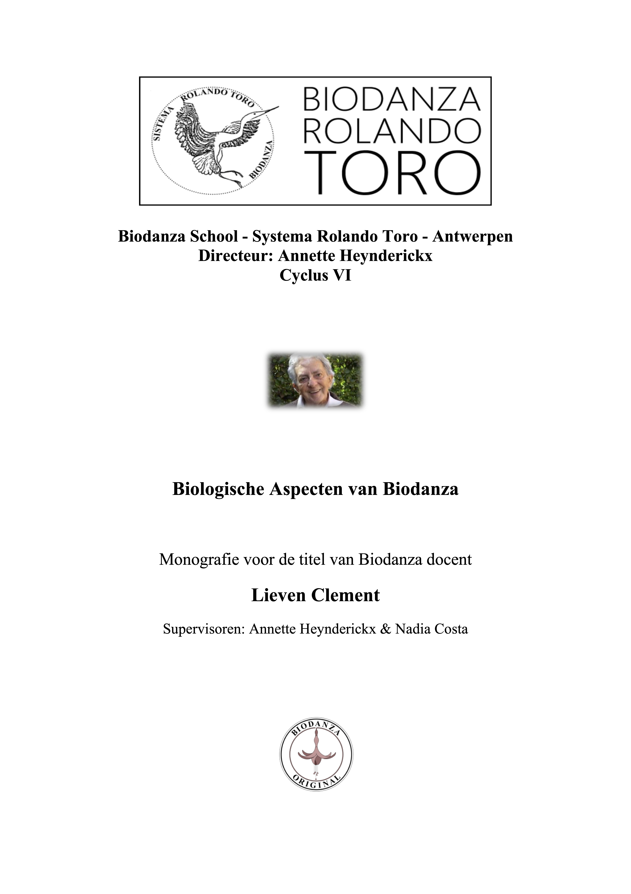

```{r include=FALSE}
# automatically create a bib database for R packages
knitr::write_bib(c(
  .packages(), 'bookdown', 'knitr', 'rmarkdown'
), 'packages.bib')

#bookdown::render_book("index.Rmd", "bookdown::gitbook")
#bookdown::render_book("index.Rmd", "bookdown::pdf_book")
```

<!--
```{asis, eval=(knitr::is_html_output())}
# {-}

```
-->

```{r, eval=knitr::is_html_output(excludes = "epub"), results = 'asis', echo = F}
cat('
# {-}
<center>

Biodanza School - Systema Rolando Toro - Antwerpen 

Directeur: Annette Heynderickx

Cyclus VI

Monografie voor de titel van Biodanza docent

Lieven Clement

Supervisoren: Annette Heynderickx & Nadia Costa


Gebruik de iconen < en > of het menu om door de monografie te navigeren

'
)
```


# Opname van Lievens voordracht {.unnumbered}

Met dank aan Luc Arretz die deze opname maakte tijdes de voordracht van Lievens eindwerk op 02/03/2024 (46 min).   

```{r, eval=knitr::is_html_output(excludes = "epub"), results = 'asis', echo = F}
cat('
<div><div style="position:relative; padding-top: 56.25%">
<iframe src="https://www.youtube.com/embed/mDkPJ8pmnYA?si=a6V-tPFzMRMC3bfG"frameborder="0" allowfullscreen
      style="position:absolute;top:0;left:0;width:100%;height:100%;"></iframe>
</div></div>

</center>
')
```

Link naar de opname: [https://youtu.be/mDkPJ8pmnYA](https://youtu.be/mDkPJ8pmnYA)


# Licentie and links {.unnumbered}

Deze monografie wordt gedeeld onder de <a href= "https://creativecommons.org/licenses/by-nc-sa/4.0"> CC BY-NC-SA 4.0</a> licentie op `r format(Sys.time(), "%d %B, %Y")`.

Het werk mag worden gebruikt voor niet-commerciële doeleinden. 

Je bent vrij om het materiaal te kopiëren, te verspreiden en door te geven via elk medium of bestandsformaat. Om het te bewerken, te veranderen en afgeleide werken te maken. De gebruiker dient de maker van het werk te vermelden, een link naar de licentie te plaatsen en aan te geven of het werk veranderd is. Als je het werk hebt veranderd, of op het werk hebt voortgebouwd, moet je het veranderde materiaal verspreiden onder dezelfde licentie als het originele werk.


Een pdf versie van het eboek kan je hier vinden: [Biologische-Aspecten-van-Biodanza.pdf](https://biodanzabrugge.be/biologischeAspectenBiodanza/Biologische-Aspecten-van-Biodanza.pdf)

An English version of this ebook can be found on: [BiologicalAspectsBiodanza](https://biodanzabrugge.be/biologicalAspectsBiodanza/)

\mainmatter

# Dankwoord {-}

Mijn weg naar deze monografie is een pad van een heel leven.  
Alles wat ik in me heb, kantelde hier finaal in samen. 

Ik kwam ter wereld in een warm nest waar muziek door het huis vibreerde.   
Een nest waar ik naast de passie voor muziek ook werd geprikkeld om na te denken en om mijn hersenspinsels woorden te geven.   
Een nest die me ook de ruimte gaf om een passie voor wetenschap te ontwikkelen.  

Toen ik achtien werd stond ik voor een keuze, wordt het muziek of wetenschap.  
Het werd de wetenschap.  
Die weg leidde me uiteindelijk tot mijn passie in statistical genomics, een tak van de statistiek die ons toelaat om uit massieve datasets te leren welke genen anders tot expressie komen als gevolg van interne en externe stimuli, ecofactoren, ziekte, ons genetisch potentieel, ...   
Wat een belangrijke component zou blijken te zijn voor mijn begrip van het model van Biodanza.

Op dat wetenschappelijke pad was muziek naar de achtergrond verdwenen,   
vergroeide ik langzaam aan steeds meer met mijn hoofd,  
en werd mijn passie wat mechanisch door het Cartesiaanse denken die zo ruim verspreid is in de academische wereld. 

Maar gelukkig was daar Fien.  
Fien die me als een baken steeds weer naar het hier en nu wist te brengen.  
Fien die me telkens weer toonde dat het leven zoveel meer is.   
Fien die me het vaderschap leerde kennen en me drie zonen schonk.  

Fien ook jij was het die uiteindelijk Biodanza op ons pad bracht,  
waardoor weten voor mij weer voelen werd, en  
hoofd en hart weer mochten gaan versmelten. 

Biodanza die het beste in ons beiden naar boven brengt,  
die ons samenzijn transformeert naar wat Rolando 
het ecologische koppelzijn zou noemen,   
omdat het onze sterktes smeedt tot een gedeelde passie,   
tot een nieuwe manier van leven. 

En zo bracht jij ook Annette & Frank op mijn pad.   
Eerst in je verhalen over de Biodanza opleiding die je volgde,  
daarna door me mee te nemen naar hun Biodanza Stages in de Franse Ardennen,    
en uiteindelijk door me helemaal te steunen om te starten in de nieuwe cyclus van de opleiding.

Een pad die me radicaal transformeerde.  
Muziek, beweging, dans, passie, wetenschap, lichaam, geest,
het kwam allemaal weer samen en werd weer één.  
Jullie lieten me ervaren hoe alles vertrekt vanuit het intens beleven van het leven, hier en nu.   
Vivencia dus,  
die me zijn gaan transformeren,  
en dat is een kunst die jij Annette als geen ander verstaat^[Een weerklank hiervan kan je terugvinden in het addendum van deze monografie]. 

Naast vivencia, prikkelde je me in de opleiding ook door die vele wetenschappelijke concepten op me los te laten waarop Biodanza is gestoeld. 
Die lieten de passie voor de wetenschap weer helemaal bij mij oplaaien. 

En toen deed je iets onvoorstelbaars...  
Met een ongelofelijk vertrouwen
nodigde je me uit om samen de theorie van de Biologische Aspecten van Biodanza te brengen in de opleiding.  
Iets die mijn transformatie helemaal in een stroomversnelling bracht en een jaar later uitkantelde in de eerste ruwe versie van deze monografie.  

Een versie die ik Annemie en Frederieke heb laten lezen, 
en waarvan ik, als ik er nu aan terug denk, licht begin te blozen.  
Maar jullie feedback was essentiel om mijn schrijfsels beter af te stemmen op mijn doelpubliek. 

Een half jaar later was het alweer jij, Annette, 
die met een meesterzet het momentum nog maar eens zou gaan vergroten.  
Het gebeurde aan jullie caravanneke 
in het zuiden van Frankrijk.  
Net voor de start van de extensie "het pad van extase" zette je mij en Fien samen met Nadia, een van de meest inspirerende personen die ik heb mogen ontmoeten...  
En je vroeg haar om mijn monografie te begeleiden.  

En Nadia,  
tijdens die extensie ging ik aan je lippen...  
Ieder woord resoneerde...  
Je spreekt de taal van het hart,  
de taal van het leven  
en dat met zoveel eenvoud en zo een diepgang.  
En tussen de regels door
herkende ik ook zoveel van 
de taal die me zo vertrouwd is,   
die van de wetenschap.  
En daarbovenop kwam nog eens de fenomenale taal van je beweging...   
Zo inspirerend. 

In de maanden die kwamen heb je me met zo veel geduld en passie 
meegenomen op de wandeling door mijn monografie.  
Haarscherp wist je die te fileren,   
te verdiepen,   
en nog meer tot leven te wekken.

Iedere zoom-call was zo transformerend...  
Zelden was ik zo wakker, alert en helder.   
Ieder woord telde...  
En telkens was er wel weer een nieuwe zin die dagen na bleef zinderen en de basis vormde van een volledig nieuwe call.  

Je gaf me zoveel inzicht en vertrouwen.  
Je nodigde me uit om te zoeken,  
om de theorie van de biologische aspecten te doorvoelen, en   
om die te verbinden met de methodologie van Biodanza.  

En toen gaf je me je zegen om mijn monografie de wereld in te sturen,   
maar niet zonder een laatste knipoog naar de rijkdom van Rolando's systeem:   
"Et maintenant,  
tu peux faire la même chose pour  
les aspects fysiologiques,  
les aspects psychologiques,  
les prédécesseurs mythiques et philosophiques,   
..."  

En tot slot wil ik iedereen nog bedanken waarmee ik heb mogen dansen.   
In het bijzonder de mensen van de opleiding, en van onze maandag- en woensdag groep in Brugge.   
Onze dansen hebben me gevormd, en   
door jullie kan ik de schoonheid van het Biodanza-leraar-zijn ook gaan ontdekken...  

   


-- Februari 2024 --

# Samenvatting {-}

Ik begon in 2021 aan de lerarenopleiding Biodanza aan de School van Antwerpen. De verrijkte omgeving veranderde mijn kijk op het leven en hoe ik het leven ervaar volledig. Het zorgde voor een enorme persoonlijke groei en stimuleerde mij om mijn geest, lichaam en hart opnieuw te verbinden.

Tijdens de eerste module van de lerarenopleiding stond ik versteld om te zien dat de verticale as in het model van Biodanza zo nauw verweven leek te zijn met mijn wetenschappelijke pad van de afgelopen 25 jaar. Rolondo Toro werd bij de ontwikkeling van zijn Systeem van Biodanza door zoveel vooraanstaande wetenschappers geïnspireerd. Tijdens mijn formele wetenschappelijke opleiding kwam ik echter nooit in aanraking met veel van de concepten die in de eerste modules van de lerarenopleiding aan bod kwamen, en ik kon deze niet vatten zonder het werk van de oorspronkelijke auteurs te raadplegen.

Mijn monografie weerspiegelt dan ook mijn zoektocht om Rolando's visie op de biologische aspecten te begrijpen, die aan de basis liggen van zijn model van Biodanza. In het eerste hoofdstuk introduceer ik het model van Biodanza. In het tweede hoofdstuk probeer ik Rolando's kijk op het leven, zijn biocentrische principe en zijn concept "vitaal onbewuste" te verduidelijken. In dat hoofdstuk leg ik ook de basis voor de overige drie hoofdstukken die elk focussen op een belangrijk biologisch aspect in het model van Biodanza: (3) Principes van kosmisch leven en de ontstaansgeschiedenis van het leven, een kort verhaal over de geschiedenis van het universum tot aan de oorsprong van het leven, (4) Fylogenese en evolutie, waarin ik de geschiedenis van het leven en hoe het leven evolueerde kort introduceer, en (5) Ontogenese, waar ik toelicht hoe wij evolueren vanaf onze oorsprong van bevruchte eicel tot volwassenheid, totdat we uiteindelijk sterven. In het vijfde hoofdstuk ligt de nadruk sterk op epigenetica, de ontbrekende schakel die Rolando Toro nodig had om uit te leggen hoe Biodanza een verrijkte omgeving induceert die verandering teweegbrengt in hoe we ons genetisch potentieel gebruiken. Tenslotte sluit ik deze monografie af met enkele slotopmerkingen en met een addendum met enkele impressies die ik tijdens mijn Biodanza-lerarenopleiding heb geschreven.

